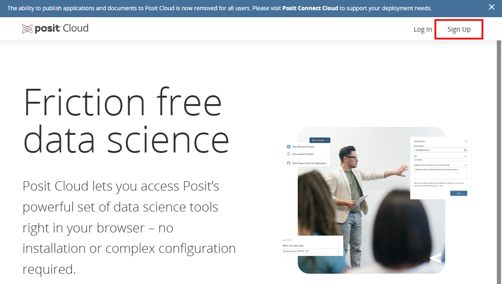
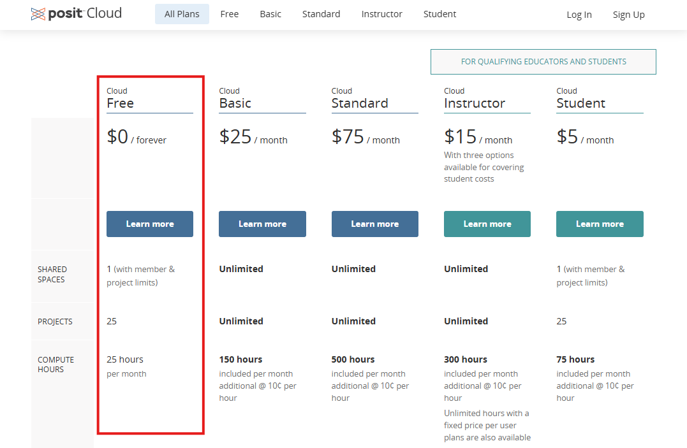
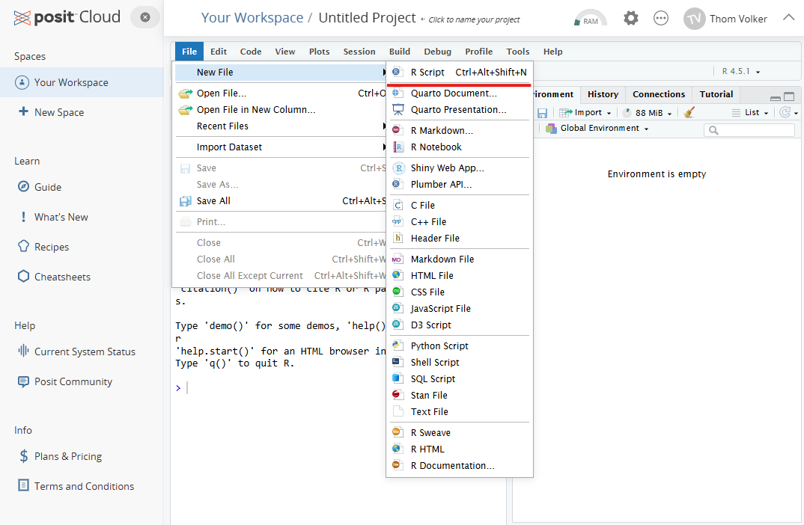
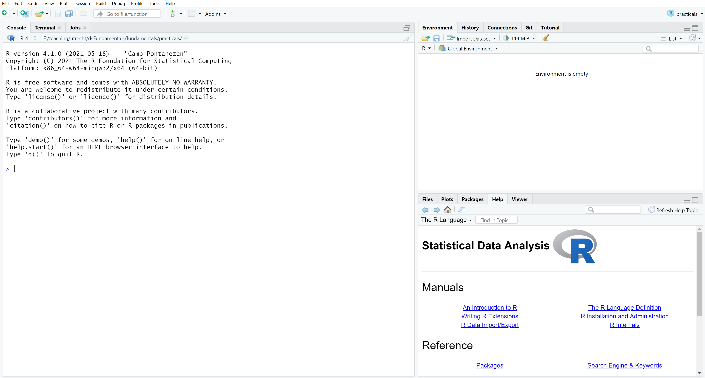
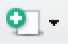
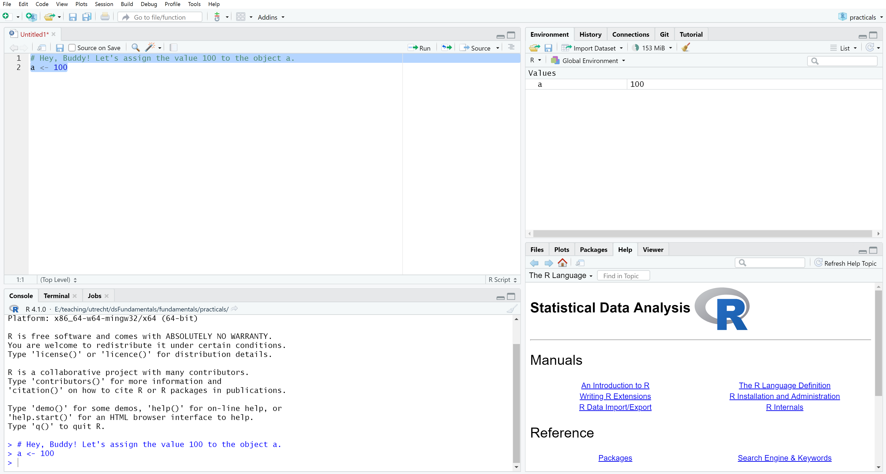
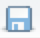
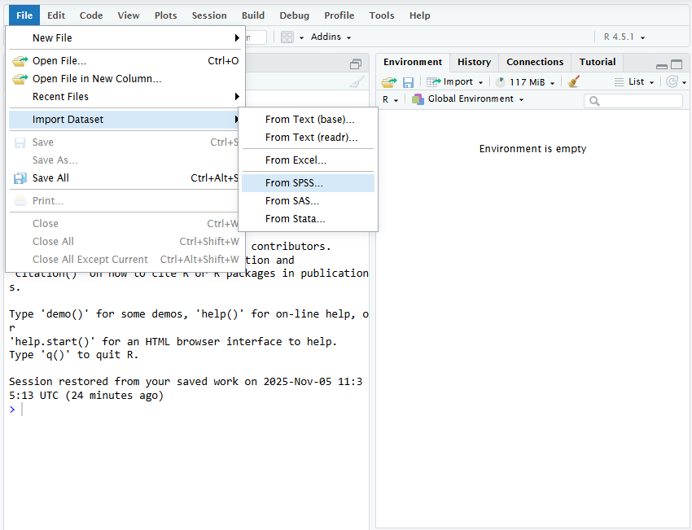

## Software

Installation of R and RStudio *or* login on Posit Cloud.

### Own laptop: RStudio

__1. Check R version (you will need version 4.1 or higher)__

```{r}
R.version$version.string
```

__2. Check installation of R packages__

```{r}
#| eval: false
install.packages(c("mice", "ggmice", "ggplot2"))
```

You can verify whether all packages are installed correctly by running:

```{r}
all(c("mice", "ggmice", "ggplot2") %in% rownames(installed.packages()))
```

### Online: Posit Cloud

__1. Ga to [https://posit.cloud/](https://posit.cloud/) and click on "Sign Up" in the top-right corner.__

{width="70%"}

__2. Select "Cloud free" by clicking "Learn more" and sign up.__

{width="70%"}

__3. Go to [https://docs.posit.co/cloud/get_started/](https://docs.posit.co/cloud/get_started/) and follow the instructions up to and including "Create a Project"__

__4. Open a fresh `R`-file: "File --> New file --> R script"__

{width="70%"}

## Not used to working with `R`?

Then follow this short tutorial!

<!-- ## Brochuretekst -->

<!-- "Tijdens het voorbereidende gesprek is besproken welke software gebruikt zal worden  -->
<!-- tijdens de cursus. Binnen het onderzoeksteam van het St. Antonius Ziekenhuis  -->
<!-- werken sommige onderzoekers met SPSS, terwijl anderen ervaring hebben met R.  -->
<!-- Voor deze cursus is gekozen om te werken met R, omdat dit pakket de meest  -->
<!-- uitgebreide en flexibele mogelijkheden biedt voor het analyseren en behandelen van  -->
<!-- missing data. -->
<!-- Om de cursus toegankelijk te maken voor alle deelnemers, ongeacht hun ervaring  -->
<!-- met statistische software, is het programma zo ingericht dat er tijdens de praktische  -->
<!-- oefeningen geen programmeerkennis vereist is. Alle benodigde R-code wordt  -->
<!-- aangeleverd en kan eenvoudig worden uitgevoerd via copy & paste. -->

<!-- De cursus maakt gebruik van Posit Cloud, een gratis, online omgeving voor R die via  -->
<!-- de browser toegankelijk is. Dit betekent dat deelnemers geen software hoeven te  -->
<!-- installeren om mee te doen. Voor deelnemers die al met R en RStudio werken,  -->
<!-- verstrekt de docent vooraf instructies voor het installeren van de meest recente  -->
<!-- versies. -->

<!-- Daarnaast wordt er specifiek aandacht besteed aan deelnemers die normaal  -->
<!-- gesproken met SPSS werken. Zij leren hoe zij hun data vanuit SPSS kunnen inlezen in  -->
<!-- R, hoe zij in R missing data kunnen analyseren en behandelen, en hoe zij de  -->
<!-- aangepaste datasets desgewenst weer kunnen exporteren naar SPSS voor verdere  -->
<!-- verwerking of rapportage." -->

---

**Open RStudio (in Posit Cloud)**

The following window will appear. 



RStudio is divided into 3 panes: the console, the environment/history pane, and 
a pane wherein you can access your files, plots, help files, etc. You can 
rearrange the panes through RStudio's preferences.

When we open an R script (i.e. a file that contains R code), a fourth pane will 
open to show the script. 

---


**Open a new R script**

In the top left you will find this button: 
{width=5%}. Click it and select "R Script". 

A new pane will open, and you can start writing code in this new script. Unless 
you're just using R as a simple calculator, you should work with R scripts 
instead of writing your code directly in the console. Doing so has at least the 
following advantages. 

a. You will not lose your work, since all of the commands you execute are 
written in a script.  
a. You log your workflow. Code does not disappear over time, so you can always 
tell what analyses you did for a project. 
a. With access to your R script(s) and data, others can exactly reproduce your 
work.  
a. You coding will become more organized as you start trying to write more 
readable code. In the long run, this increased organization will make you a more 
efficient programmer. Remember: Efficient code runs faster! 

---


**Type the following into your new R script**

```{r}
# Hey, Buddy! Let's assign the value 100 to the object a.
a <- 100
```

The comment character, `#`, tells the R interpreter to ignore everything that 
follows in that specific line. Since nothing following a `#` will be interpreted 
as R code, you can use `#` to comment your code. 

The line `a <- 100` assigns the value `100` to the object `a`. When you run this 
line, a new object called `a` will be saved to your environment and given the 
value `100`. The value `100` and the name `a` are completely arbitrary. You 
could just as well assign the value`"bar"` to the object `foo`, if you like. 

---


**Execute the commands in your script**

Select both lines of code shown above, and execute them by pressing Ctrl-Enter 
or Ctrl-R (Windows/Linux) or Cmd-Enter (Mac)

After your code is executed the results appear in the console. If you type `a` 
in the console, R will return the assigned value. Try it. 


The shortcut Ctrl-Enter or Cmd-Enter is your friend: it runs the current 
selection, or---if nothing is selected---the current line. If pressing 
Ctrl-Enter or Cmd-Enter yields no result, you probably have the console pane 
selected. You can switch to the code pane by using the mouse to click on the 
desired line in the code pane or by pressing Ctrl-1 (Windows/Linux/Mac). You can 
select the console by pressing Ctrl-2 (Windows/Linux/Mac). 

---

**Save your code file as *testrun.R* in a folder named *practicals***

You can use the standard Ctrl-s (Windows/Linux) or Cmd-s (Mac) or click on the 
{width=3%} icon in the code pane. Your document is
now saved. Saving your script in a separate folder will allow you to create an 
RStudio project for your practicals. 

---


**Close the *testrun.R* script in the code pane**

Even though you've closed the script, your code is still saved as a permanent 
code file.

---

**Open the *testrun.R* script**

1. Navigate to the *practicals* directory using the RStudio files pane.
1. Click on the *testrun.R* file in the files pane to re-open the script. 
1. Run both lines of code again.
1. Inspect the contents of the global environment in the 'Environment' tab,
or by executing the `ls()` function.

You should see something like the following
```{r}
ls()
```

There is only one object in the environment, and it is called `a`. If you look 
at the environment pane, you can quickly see which objects currently exist in 
the environment (i.e., you don't need to manually run `ls()`). You can also see 
some information about the objects.

**Opening data files**

In today's material, all data will be provided. If, however, you want to load your
own data file into `R`, you can do this as follows. Note, however, that it is a 
**very** bad idea to load sensitive data in a cloud-based programming environment, 
like `posit.cloud`. Moreover, this is almost certainly not allowed by the privacy
regulations your instition has to adhere to.

Locally, you can import `SPSS` data into `R` by clicking on "File --> Import Dataset
--> From SPSS". If your data is not a `.sav` file, choose one of the other options.


