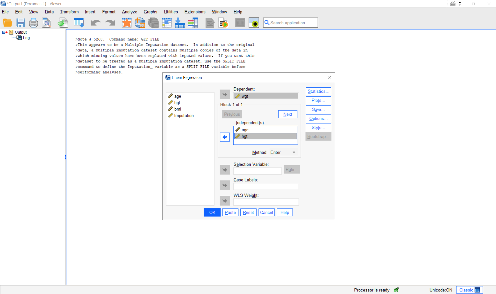
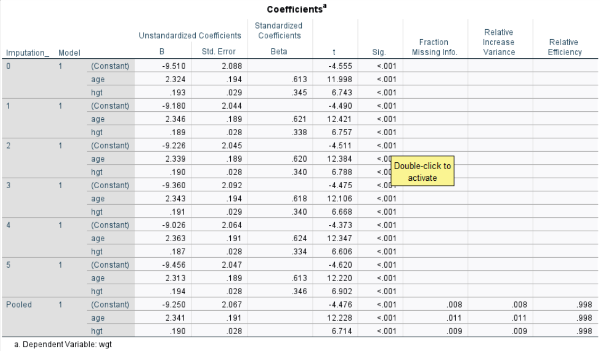

## Convergence checking and passive imputation

Het hoorcollege van dit deel is beschikbaar [via deze link](slides_03_inference.qmd){target="_blank"}.

---

In this practical, you will work with a different dataset than in the previous two. Today, we will work with a subset of the `boys` data. The `boys` data contains some biometric characteristics of 748 Dutch boys. In this practical, we will solely work with the first four variables: `age`, `hgt` (height in m), `wgt` (weight in kg) and `bmi`.

---

**0. Setup: Load the required packages `mice`, `ggmice` and `ggplot2` if you have not done so already, and create the subset of the `boys` data. Inspect the dataset and the missing data pattern. How many patterns occur for which the variable `bmi` is missing?**

---

```{r setup, warning=FALSE, message=FALSE}
library(mice)
library(ggmice)
library(ggplot2)

boys <- boys[,1:4]

help(boys)
?boys

plot_pattern(boys)

mpat <- md.pattern(boys)
sum(mpat[, "bmi"] == 0)
```
Answer: 3 patterns (21 cases)

---

**1. Impute the subset of the `boys` dataset.**

```{r, cache=FALSE}
imp <- mice(boys, print = FALSE)
```

---

The `mice()` function implements an iterative Markov Chain Monte Carlo type of algorithm. Let us have a look at the trace lines generated by the algorithm to study convergence.

**2. Inspect convergence of the algorithm using `plot_trace()`.**

```{r}
plot_trace(imp)
```

The plot shows the mean (left) and standard deviation (right) of the imputed values only. In general, we would like the streams to intermingle and be free of any trends at the later iterations. 

The algorithm uses random sampling, and therefore, the results will be (perhaps slightly) different if we repeat the imputations with different seeds. In order to get exactly the same result, use the `seed` argument 
```{r, cache=FALSE}
imp <- mice(boys, seed = 123, print = FALSE)
```
where `123` is some arbitrary number that you can choose yourself. Rerunning this command will always yields the same imputed values.

---

As we have seen in the lecture, the the default method in mice (`pmm`) faces difficulties when there are deterministic relationships in the data. Here, there is such a deterministic relationship, as `bmi` is a direct function of `hgt` and `wgt`. 

---

**3. Change the imputation method and predictor matrix in such that we can perform passive imputation for the `bmi` variable.**

---

For each column, the algorithm requires a specification of the imputation method. To see which method was used by default:
```{r, cache = FALSE}
imp$meth
```
The variable `age` is complete and therefore not imputed, denoted by the `""` empty string. The other variables have method `pmm`, which stands for *predictive mean matching*, the default in `mice` for numerical and integer data.  

An up-to-date overview of the methods in mice can be found by
```{r, warning=FALSE}
methods(mice)
```

Let us change the `bmi` variable in the method vector to `"~I(wgt/(hgt/100)^2)"`._

```{r, cache=FALSE}
method <- imp$meth
method["bmi"] <- "~I(wgt/(hgt/100)^2)"
```

Now, we also need to adjust the predictor matrix, and make sure that `bmi` cannot be used to impute `hgt` and `wgt`. Remember that the predictor matrix denotes each target variable in the rows, with the columns as the predictor variables.

Obtain the predictor matrix from the `imp` object, and set the `bmi` column to zero for the rows `hgt` and `wgt`.
```{r}
pred <- imp$predictorMatrix
pred[c("hgt", "wgt"), "bmi"] <- 0
```

Inspect the adjusted predictor matrix and methods vector jointly.
```{r}
plot_pred(pred, method = method)
```


---

**4. Rerun the mice algorithm with the adjusted method vector and predictor matrix.**

---

```{r, cache=FALSE}
imp <- mice(boys, meth = method, predictorMatrix = pred, print = FALSE)
```
We may now again plot trace lines to study convergence
```{r, cache = FALSE}
plot_trace(imp)
```

This looks much better! The chains are blending nicely, and indeed seem quite random.
Passive imputation is explained in more detail in [this vignette](https://gerkovink.github.io/miceVignettes/Passive_Post_processing/Passive_imputation_post_processing.html).

---

**5. Extend the number of iterations**

Though using just five iterations (the default) often works well in practice, we need to extend the number of iterations of the `mice` algorithm to confirm that there is no trend and that the trace lines intermingle well. We can increase the number of iterations to 20 by running 15 additional iterations using the `mice.mids()` function. 
```{r, cache=FALSE}
imp20 <- mice.mids(imp, maxit = 15, print = FALSE)
plot_trace(imp20)
```

**6. Check whether `bmi` is indeed accurately calculated by plotting `bmi` versus `wgt/(hgt/100)^2` using `ggmice()` and `geom_point()`.**

```{r}
ggmice(imp20, aes(x = wgt/(hgt/100)^2, y = bmi)) +
  geom_point()
```

This looks really good, we have accurately captured the deterministic relationship between `bmi` and `hgt` and `wgt`. Now we have imputed the data appropriately, we can continue and actually analyze the data set.

---

## Correct inferences with missing data

---

**7. Perform a regression analysis on the imputed dataset** with
`wgt` as dependent variable and `age` and 
`hgt` as independent variables.
```{r}
fit1 <- with(imp20, lm(wgt ~ age + hgt))
```

---

**8. Pool the regression analysis and inspect the pooled analysis.**

---

```{r}
pool(fit1)
```

This output gives the relevant pooled regression coefficients and
parameters, as well as the fraction of information about the
coefficients missing due to nonresponse (`fmi`) and the proportion of the variation attributable to the missing data (`lambda`). The pooled fit object is of class `mipo`, which stands for *multiply imputed pooled object*. 

`mice` is able to pool many analyses from a variety of packages for you. Of course, this includes all built-in statistical models in R, such as linear regression models with the `lm()` family of functions. But also more complex statistical models can be pooled, such as multilevel models or individual patient data meta-analyses. 

The pooling function works for any model, as long as the functions have a respective `broom::tidy()` or `broom::glance()` method in R. These methods extract the relevant model parameters from model output. For flexibility and in order to run custom pooling functions, mice also incorporates a function `pool.scalar()` which pools univariate estimates of $m$ repeated complete data analysis conform Rubin's pooling rules (Rubin, 1987, paragraph 3.1).

---

**9. Calculate the test statistics of the regression coefficients using the `summary()` function.**

---

```{r}
summary(pool(fit1))
```

Both variables are strongly related to `wgt` (which is of course no surprise). The column `estimate` displays the pooled regression coefficient. The column `std.error` provides the pooled standard error, that is, the square root of the total variance $T = \bar U + B + B/m$. The test statistic is calculated as `estimate/std.error`, and the degrees of freedom are calculated according to the Barnard-Rubin degrees of freedom (if you're curious, you can type `mice:::barnard.rubin` (without function parenthesis) to see how these degrees of freedom are calculated).

---

While we strongly advocate for the use of `R`, we do acknowledge that some users might use other software for statistical analyses. To accommodate these users, `mice` contains a `mids2spss()` function, that allows to extract the imputed data as a `.sav` file, which can be opened in SPSS. Do note that we are actively working on a multiple imputation module in `JASP`, a free and open-source alternative to `SPSS`. If you're curious, you can find `JASP` [here](https://jasp-stats.org/).

**OPTIONAL: 9. Export the imputed data to a `.sav`-file, and open the data in `SPSS` to reproduce our analysis.**

```{r}
mids2spss(imp20, path = tempdir())
```

Now, you can open this data in `SPSS` in the usual way. Before `SPSS` recognizes the data as a multiply imputed data set, you must `split` the data by the `Imputation_` variable. This can be done as follows:


After you have done this, you can run the regression analysis by going to "Analyze > Linear regression" like so.



Finally, you can verify that the results are indeed identical to the results obtained in `R` by inspecting the following output.



### Conclusion

We have seen that the practical execution of multiple imputation and pooling is straightforward with the `R` package `mice`. The package is designed to allow you to assess and control the imputations themselves, the convergence of the algorithm and the distributions and multivariate relations of the observed and imputed data. 

It is important to 'gain' this control as a user. After all, we are imputing values and we aim to properly adress the uncertainty about the missingness problem. 