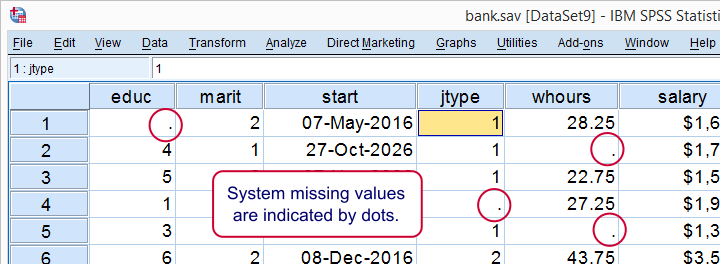
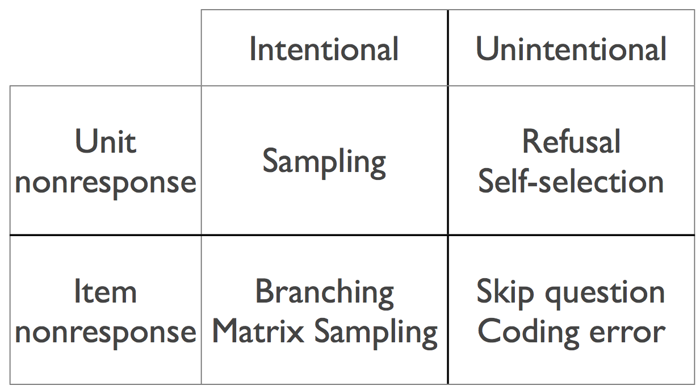
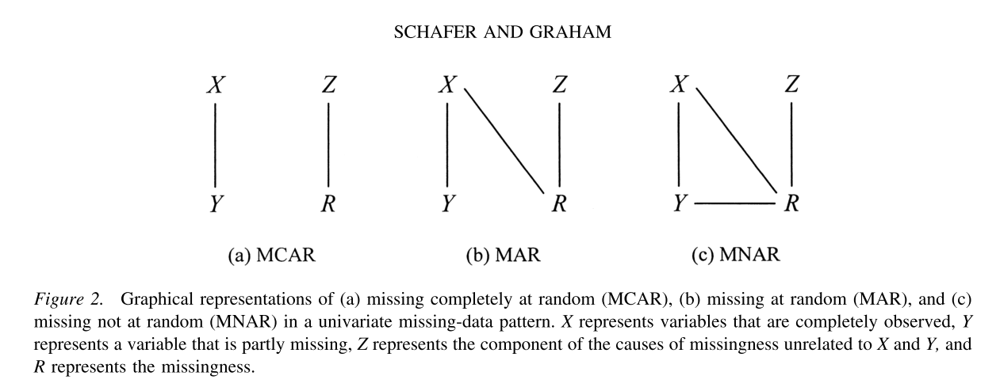
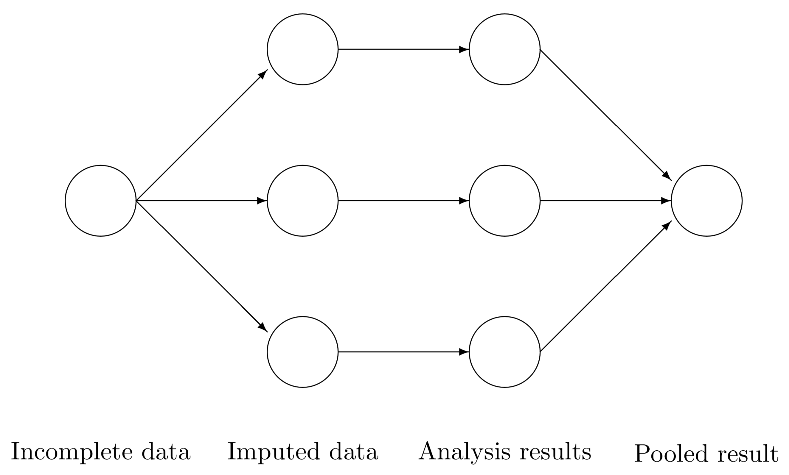

```{r setup}
library(mice)
library(ggmice)
library(ggplot2)
library(knitr)
library(xtable)
```

## Cursusoutline

1. Het probleem van missende data 
2. Multipele imputatie: het algemene idee
3. Correcte inferenties met missende data

## Take aways

1. Incomplete data kun je niet zomaar negeren
2. Missende data moet weerspiegeld worden met onzekerheid
3. Er is geen perfecte *quick fix*

## Cursuswebsite

```{r}
#| echo: false
#| fig-width: 2
#| fig-height: 2
library(qrcode)
plot(qr_code("http://amices.org/cursus_mice/00_index.html"))
```

[https://github.com/amices/cursus_mice](https://github.com/amices/cursus_mice){target="_blank"}

# Het probleem van missende data {background-color="#FFCD00"}

## Outline

- What is missing data?
- Strategies for dealing with missing data

## Missing data

> Sooner or later (usually sooner), anyone who does statistical analysis runs into problems with missing data 
> 
> - *David Allison, 2002*

{fig-align="center" width=20%}

## Definition

Missing values

- are those values that are not observed
- do exist in theory, but we are unable to see them

## Why values can be missing

Missingness can occur for a lot of reasons. For example

- death, dropout, refusal
- routing, experimental design
- join, merge, bind
- too far away, too small to observe
- power failure, budget exhausted, bad luck

## Item and unit non-response

Missing values can occur at the cell/row/column level

- Item non-response: some, but not all, responses missing for a case
- Unit non-response: no observed response at all for a case 

## Intentional and unintentional

You can classify missing values in two groups

-   Missing values that should have been observed (unintentional)
-   Missing values that should not have been observed (intentional)

## Intentional missing data

Missing data caused by the design:

-   Taking a sample
-   Predicting a future outcome
-   Combining data from different sources
-   Estimating a causal effect

## Unintentional missing data

Missing data caused by the subject:

-   Dropout, refusal, concealed
-   Too far away, too small to observe
-   Power failure, budget exhausted, bad luck

## Intentionality and non-response

{height="600"}


## Dark data

{fig-align="center" height="600"}

## Dark data? Missing values?

> Dark data are concealed from us, and that very fact means we are at risk of misunderstanding, of drawing incorrect conclusions, and of making poor decisions.
>
> — *David J. Hand, 2020*

> Missing values are unobserved values that would be meaningful for analysis if observed; in other words, a missing value hides a meaningful value.
>
> — *Roderick J.A. Little & Donald B. Rubin, 2020*

## Consequences of missing data

- Cannot calculate, not even the mean
- Less information than planned
- Enough statistical power?
- Different analyses, different $n$'s
- Systematic biases in the analysis
- Appropriate confidence interval, $P$-values?

Missing data can severely complicate interpretation and analysis

## Strategies to cope with missing data

- **Prevent**: Get the complete data (without deleting info!)
- **Ignore**: Let the software handle it
- **Treat**: Account for the reasons why data are missing

## Example

<!-- MCAR	Nothing (completely random)	Survey glitch causes random missing responses -->
<!-- MAR	Observed data	Younger people more likely to skip income question -->
<!-- MNAR	Unobserved (missing) data	High earners skip income question because of discomfort -->
```{r}
dat <- readRDS("data/income_2022_incomplete.rds")
```

## Complete data

```{r}
ggplot(dat, aes(x = age, y = income)) +
  geom_point(alpha = 0.5, color = mice::mdc(1), shape = 1) +
  theme_classic() +
  labs(y = "Income", x = "Age")
```

## Missing due to glitch

<!-- In a survey about political opinions, some respondents accidentally skip the last question because the survey software glitches randomly for a small group of users. The glitch affects people regardless of their age, political views, or any other characteristic. -->

<!-- Key Point: The missingness is like pure chance (e.g., technical errors, random loss of data), and it doesn’t bias the results if handled properly. -->


```{r}
ggplot(dat, aes(x = age, y = income, color = ind_mcar, shape = ind_mcar)) +
  geom_point(alpha = 0.5, size = 1, stroke = 1) +
  scale_color_manual(
    values = c("missing" = mice::mdc(2), "observed" = mice::mdc(1))
  ) +
  scale_shape_manual(values = c("missing" = 4, "observed" = 1)) +
  theme_classic() +
  labs(y = "Income", x = "Age", color = "", shape = "")
```


## Missing due to glitch

```{r}
ggplot(dat, aes(y = income, color = ind_mcar)) +
  geom_boxplot() +
  scale_color_manual(
    values = c("missing" = mice::mdc(2), "observed" = mice::mdc(1))
  ) +
  theme_classic() +
  labs(y = "Income", color = "")
```


## Missing due to glitch

```{r}
ggplot(dat, aes(y = income, color = ind_mcar)) +
  geom_density() +
  scale_color_manual(
    values = c("missing" = mice::mdc(2), "observed" = mice::mdc(1))
  ) +
  theme_classic() +
  labs(x = "Distribution", y = "Income", color = "")
```


## Missing lower ages


<!-- In a study on income levels, younger participants are more likely to skip the question about their annual income. However, among people of the same age group, the likelihood of skipping the question is unrelated to how much they actually earn. -->

<!-- Key Point: The missingness can be explained by other variables you’ve already collected (like age in this case). Statistical methods (like multiple imputation) can adjust for this. -->

```{r}
ggplot(dat, aes(x = age, y = income, color = ind_mar, shape = ind_mar)) +
  geom_point(alpha = 0.5, size = 1, stroke = 1) +
  scale_color_manual(
    values = c("missing" = mice::mdc(2), "observed" = mice::mdc(1))
  ) +
  scale_shape_manual(values = c("missing" = 4, "observed" = 1)) +
  theme_classic() +
  labs(y = "Income", x = "Age", color = "", shape = "")
```

## Missing lower ages

```{r}
ggplot(dat, aes(y = income, color = ind_mar)) +
  geom_boxplot() +
  scale_color_manual(
    values = c("missing" = mice::mdc(2), "observed" = mice::mdc(1))
  ) +
  theme_classic() +
  labs(y = "Income", color = "")
```

## Missing lower ages

```{r}
ggplot(dat, aes(y = income, color = ind_mar)) +
  geom_density() +
  scale_color_manual(
    values = c("missing" = mice::mdc(2), "observed" = mice::mdc(1))
  ) +
  theme_classic() +
  labs(x = "Distribution", y = "Income", color = "")
```

## Missing lower ages

```{r}
age_labs <- c("Age \u2264 35", "Age > 35")
names(age_labs) <- c(FALSE, TRUE)

ggplot(dat, aes(y = income, color = ind_mar)) +
  geom_density() +
  scale_color_manual(
    values = c("missing" = mice::mdc(2), "observed" = mice::mdc(1))
  ) +
  theme_classic() +
  labs(x = "Distribution", y = "Income", color = "") +
  facet_wrap(~ age > 35, nrow = 1, labeller = labeller(`age > 35` = age_labs))
```

## Missing higher incomes

<!-- In the same income survey, people with very high incomes are more likely to leave the income question blank because they feel uncomfortable disclosing it. Even after controlling for age, education, and other factors, the missingness is still related to the actual income, which is missing. -->

<!-- Key Point: The missingness depends on information you don’t have, making it the most challenging type. Advanced modeling or sensitivity analysis is often needed. -->


```{r}
ggplot(dat, aes(x = age, y = income, color = ind_mnar, shape = ind_mnar)) +
  geom_point(alpha = 0.5, size = 1, stroke = 1) +
  scale_color_manual(
    values = c("missing" = mice::mdc(2), "observed" = mice::mdc(1))
  ) +
  scale_shape_manual(values = c("missing" = 4, "observed" = 1)) +
  theme_classic() +
  labs(y = "Income", x = "Age", color = "", shape = "")
```

## Missing higher incomes

```{r}
ggplot(dat, aes(y = income, color = ind_mnar)) +
  geom_boxplot() +
  scale_color_manual(
    values = c("missing" = mice::mdc(2), "observed" = mice::mdc(1))
  ) +
  theme_classic() +
  labs(y = "Income", color = "")
```

## Missing higher incomes

```{r}
ggplot(dat, aes(y = income, color = ind_mnar)) +
  geom_density() +
  scale_color_manual(
    values = c("missing" = mice::mdc(2), "observed" = mice::mdc(1))
  ) +
  theme_classic() +
  labs(x = "Distribution", y = "Income", color = "")
```

<!-- ## Missing higher incomes -->

<!-- ```{r} -->
<!-- ggplot(dat, aes(y = income, color = ind_mnar)) + -->
<!--   geom_density() + -->
<!--   scale_color_manual(values = c("missing" = mice::mdc(2), "observed" = mice::mdc(1))) + -->
<!--   theme_classic() + -->
<!--   labs(x = "Distribution", y = "Income", color = "") + -->
<!--   facet_wrap(~age > 35, nrow = 1, labeller = labeller(`age > 35` = age_labs)) -->
<!-- ``` -->

## MCAR: Missing Completely at Random

-   Probability to be missing is not related to any data

-   Examples
    -   data transmission error
    -   random sample
    
## MCAR

```{r}
ggplot(dat, aes(x = age, y = income, color = ind_mcar, shape = ind_mcar)) +
  geom_point(alpha = 0.5, size = 1, stroke = 1) +
  scale_color_manual(
    values = c("missing" = mice::mdc(2), "observed" = mice::mdc(1))
  ) +
  scale_shape_manual(values = c("missing" = 4, "observed" = 1)) +
  theme_classic() +
  labs(y = "Income", x = "Age", color = "", shape = "")
```

## MAR: Missing at Random

-   Probability to be missing depends on known data

-   Examples
    -   Blood pressure, where we have $X$ related to health
    -   Branch patterns (e.g. how old are your children?)

## MAR

```{r}
ggplot(dat, aes(x = age, y = income, color = ind_mar, shape = ind_mar)) +
  geom_point(alpha = 0.5, size = 1, stroke = 1) +
  scale_color_manual(
    values = c("missing" = mice::mdc(2), "observed" = mice::mdc(1))
  ) +
  scale_shape_manual(values = c("missing" = 4, "observed" = 1)) +
  theme_classic() +
  labs(y = "Income", x = "Age", color = "", shape = "")
```

## MNAR: Missing Not at Random

-   Probability to be missing depends on unknown data

-   Examples
    -   Blood pressure, without covariates related to health
    -   Recreational drug use report

## MNAR

```{r}
ggplot(dat, aes(x = age, y = income, color = ind_mnar, shape = ind_mnar)) +
  geom_point(alpha = 0.5, size = 1, stroke = 1) +
  scale_color_manual(
    values = c("missing" = mice::mdc(2), "observed" = mice::mdc(1))
  ) +
  scale_shape_manual(values = c("missing" = 4, "observed" = 1)) +
  theme_classic() +
  labs(y = "Income", x = "Age", color = "", shape = "")
```

## Graphical representation



## Overview

-   **Missing Completely at Random** (MCAR/not data dependent)
    -   missingness is purely random
    -   relatively easy to deal with
-   **Missing at Random** (MAR/seen data dependent)
    -   missingness related to observed information
    -   widely used for principled analysis
-   **Missing Not at Random** (MNAR/unseen data dependent)
    -   missingness related to unobserved information
    -   cannot detect this from the data
    -   difficult to deal with, need context information

## Strategies

::: {.nonincremental}
- ~~Prevention~~
- ~~Ignoring missing data~~
- Treating missing data
    - Deletion-based methods
    - ~~Weighting~~ 
    - ~~Likelihood-based methods~~ 
    - Ad-hoc imputation methods
    - Multiple imputation
:::

## Listwise deletion

-   Analyze only the complete records
-   Also know as: complete-case analysis
-   Advantages
    -   Simple (default in most software)
    -   Unbiased only under strict conditions
    -   Conservative standard errors, significance levels
    -   Two special properties in regression

## Listwise deletion

-   Disadvantages
    -   Wasteful
    -   May not be possible
    -   Larger standard errors
    -   Biased under most conditions, even for simple statistics like the mean
    -   Inconsistencies in reporting

<!-- ## Listwise deletion: Special properties -->

<!-- -   For any regression with missing data in the predictors, estimates under listwise deletion are unbiased as long as the missingness does not depend on the outcome. Even some MNAR cases (Glynn 1986; Little 1992). -->
<!-- -   In logistic regression only: With missing data in either the outcome $Y$ or the predictors $X$ (but not both), estimates of regression weights (but not the intercept) after listwise deletion are unbiased as long as the missingness depends only on $Y$ (and not on $X$!) (Vach 1994). This property is widely exploited in case-control studies in epidemiology. -->
<!-- -   See FIMD 2.7: <https://stefvanbuuren.name/fimd/sec-when.html> -->


## Mean imputation

- Replace the missing values by the mean of the observed data
- Advantages
  + Simple
  + Unbiased for the mean, under MCAR

## Mean imputation

```{r}
#| layout-ncol: 2
#| fig-width: 5
#| fig-height: 5
source("R/mi.hist.R")

## ----load, eval = FALSE--------------------------------------------------
library("mice")

## ----meanimp, echo=TRUE--------------------------------------------------
imp <- mice(airquality, method = "mean", m = 1, maxit = 1, print = FALSE)

## ----plotmeanimp, echo=FALSE----
lwd <- 0.6
data <- complete(imp)
Yobs <- airquality[, "Ozone"]
Yimp <- data[, "Ozone"]
mi.hist(
  Yimp,
  Yobs,
  b = seq(-20, 200, 10),
  type = "continuous",
  gray = F,
  lwd = lwd,
  obs.lwd = 1.5,
  mis.lwd = 1.5,
  imp.lwd = 1.5,
  obs.col = mdc(4),
  mis.col = mdc(5),
  imp.col = "transparent",
  mlt = 0.08,
  main = "",
  xlab = "Ozone (ppb)",
  axes = FALSE
)
box(lwd = 1)
plot(
  data[cci(imp), 2:1],
  col = mdc(1),
  lwd = 1.5,
  ylab = "Ozone (ppb)",
  xlab = "Solar Radiation (lang)",
  ylim = c(-10, 170),
  axes = FALSE
)
points(data[ici(imp), 2:1], col = mdc(2), lwd = 1.5)
axis(1, lwd = lwd)
axis(2, lwd = lwd, las = 1)
box(lwd = 1)
```

## Mean imputation

- Disadvantages
  + Disturbs the distribution
  + Underestimates the variance
  + Biases correlations to zero
  + Biased under MAR
- AVOID (unless you know what you are doing)

## Regression imputation

- Also known as **prediction**
  + Fit model for $Y^{\rm obs}$ under listwise deletion
  + Predict $Y^{\rm mis}$ for records with missing $Y$'s
  + Replace missing values by prediction
- Advantages
  + Under MAR, unbiased estimates of regression coefficients
  + Good approximation to the (unknown) true data if explained variance is high
- Favourite among data scientists and machine learners

## Regression imputation

```{r}
#| layout-ncol: 2
#| fig-width: 5
#| fig-height: 5
## ----regimp, echo=TRUE---------------------------------------------------
fit <- lm(Ozone ~ Solar.R, data = airquality)
pred <- predict(fit, newdata = ic(airquality))

## ----plotregimp, duo = TRUE, echo=FALSE, fig.width=4.5, fig.height=2.25----
lwd <- 0.6
Yobs <- airquality[, "Ozone"]
Yimp <- Yobs
Yimp[ici(airquality)] <- pred
ss <- cci(airquality$Solar.R)
data <- data.frame(Ozone = Yimp, Solar.R = airquality$Solar.R)
mi.hist(
  Yimp[ss],
  Yobs[ss],
  b = seq(-20, 200, 10),
  type = "continuous",
  gray = F,
  lwd = lwd,
  obs.lwd = 1.5,
  mis.lwd = 1.5,
  imp.lwd = 1.5,
  obs.col = mdc(4),
  mis.col = mdc(5),
  imp.col = "transparent",
  mlt = 0.08,
  main = "",
  xlab = "Ozone (ppb)",
  axes = FALSE
)
box(lwd = 1)
plot(
  data[cci(imp), 2:1],
  col = mdc(1),
  lwd = 1.5,
  ylab = "Ozone (ppb)",
  xlab = "Solar Radiation (lang)",
  ylim = c(-10, 170),
  axes = FALSE
)
points(data[ici(imp), 2:1], col = mdc(2), lwd = 1.5)
axis(1, lwd = lwd)
axis(2, lwd = lwd, las = 1)
box(lwd = 1)
```

## Regression imputation

- Disadvantages
  + Artificially increases correlations
  + Systematically underestimates the variance
  + Too optimistic $P$-values and too short confidence intervals
- AVOID. Harmful to statistical inference

## Stochastic regression imputation

- Like regression imputation, but adds appropriate noise
  to the predictions to reflect uncertainty
- Advantages
  + Preserves the distribution of $Y^{\rm obs}$ 
  + Preserves the correlation between $Y$ and $X$ in the imputed data

## Stochastic regression imputation

```{r}
#| layout-ncol: 2
#| fig-width: 5
#| fig-height: 5
## ----sri-----------------------------------------------------------------
data <- airquality[, c("Ozone", "Solar.R")]
imp <- mice(
  data,
  method = "norm.nob",
  m = 1,
  maxit = 1,
  seed = 4,
  print = FALSE
)

## ----plotsri, duo = TRUE, echo=FALSE, fig.width=4.5, fig.height=2.25-----
lwd <- 0.6
data <- complete(imp)
Yobs <- airquality[, "Ozone"]
Yimp <- data[, "Ozone"]
mi.hist(
  Yimp,
  Yobs,
  b = seq(-20, 200, 10),
  type = "continuous",
  gray = FALSE,
  lwd = lwd,
  obs.lwd = 1.5,
  mis.lwd = 1.5,
  imp.lwd = 1.5,
  obs.col = mdc(4),
  mis.col = mdc(5),
  imp.col = "transparent",
  mlt = 0.08,
  main = "",
  xlab = "Ozone (ppb)"
)
box(lwd = 1)
plot(
  data[cci(imp), 2:1],
  col = mdc(1),
  lwd = 1.5,
  ylab = "Ozone (ppb)",
  xlab = "Solar Radiation (lang)",
  ylim = c(-10, 170),
  axes = FALSE
)
points(data[ici(imp), 2:1], col = mdc(2), lwd = 1.5)
axis(1, lwd = lwd)
axis(2, lwd = lwd, las = 1)
box(lwd = 1)
```

## Stochastic regression imputation

- Disadvantages
  + Symmetric and constant error restrictive
  + Single imputation: does not take uncertainty imputed data into account, and incorrectly treats them as real
  + Not so simple anymore

## Overview of assumptions needed

  ------------ ------ ---------------- ------------- -------------
                         Unbiased                    Standard Error
                Mean     Reg Weight     Correlation
  Listwise      MCAR        MCAR           MCAR        Too large
  Pairwise      MCAR        MCAR           MCAR       Complicated
  Mean          MCAR         –               –         Too small
  Regression    MAR         MAR              –         Too small
  Stochastic    MAR         MAR             MAR        Too small
  LOCF           –           –               –         Too small
  Indicator      –           –               –         Too small
  ------------ ------ ---------------- ------------- -------------

## Multiple imputation

- Core idea: Replace each missing value by m > 1 plausible draws rather than a single estimate.
- Uncertainty representation: The variability across these draws reflects the inherent uncertainty about the unobserved true value.
- Implementation: For each missing cell, generate m imputations (e.g., m = 20), resulting in m completed datasets for downstream analysis.

## Multiple imputation

{width="80%"}

## Acceptance of multiple imputation

```{r fig.width=8, fig.height=4, solo = TRUE, fig.cap = "Source: Scopus (May 5, 2025)"}
cit <- c(
  # 2025, 29, 278, NA,
  2024,
  68,
  677,
  NA,
  2023,
  66,
  631,
  NA,
  2022,
  84,
  663,
  NA,
  2021,
  72,
  594,
  NA,
  2020,
  67,
  546,
  NA,
  2019,
  63,
  471,
  NA,
  2018,
  66,
  417,
  NA,
  2017,
  73,
  367,
  NA,
  2016,
  84,
  335,
  NA,
  2015,
  62,
  312,
  NA,
  2014,
  60,
  291,
  NA,
  2013,
  46,
  231,
  NA,
  2012,
  47,
  215,
  NA,
  2011,
  56,
  182,
  NA,
  2010,
  45,
  158,
  NA,
  2009,
  37,
  112,
  NA,
  2008,
  29,
  104,
  NA,
  2007,
  35,
  114,
  NA,
  2006,
  19,
  77,
  NA,
  2005,
  21,
  62,
  NA,
  2004,
  7,
  44,
  NA,
  2003,
  18,
  38,
  NA,
  2002,
  16,
  38,
  NA,
  2001,
  14,
  36,
  57,
  2000,
  8,
  19,
  33,
  1999,
  6,
  18,
  47,
  1998,
  6,
  12,
  22,
  1997,
  6,
  17,
  29,
  1996,
  5,
  12,
  28,
  1995,
  3,
  5,
  20,
  1994,
  4,
  6,
  34,
  1993,
  3,
  6,
  15,
  1992,
  NA,
  4,
  NA,
  1991,
  3,
  4,
  19,
  1990,
  2,
  3,
  15,
  1989,
  NA,
  2,
  11,
  1988,
  NA,
  1,
  13,
  1987,
  NA,
  2,
  10,
  1986,
  2,
  3,
  5,
  1985,
  NA,
  NA,
  1,
  1984,
  NA,
  1,
  2,
  1983,
  NA,
  NA,
  5,
  1982,
  NA,
  NA,
  2,
  1981,
  NA,
  NA,
  1,
  1980,
  NA,
  NA,
  5,
  1979,
  NA,
  NA,
  2,
  1978,
  NA,
  NA,
  1,
  1977,
  NA,
  NA,
  2
)
cit <- matrix(cit, nc = 4, byrow = TRUE)
cit <- as.data.frame(cit)
names(cit) <- c("Year", "Title", "Abstract", "All")
par(cex = 0.7, lwd = 0.5)
plot(
  x = cit$Year,
  y = cit$Abstract,
  type = "n",
  xlim = c(1980, 2026),
  ylim = c(1, 700),
  ylab = "Number of publications",
  xlab = "Year",
  pch = 24,
  bg = "white",
  axes = FALSE
)
# fills <- viridisLite::viridis(10, alpha = 0.3, option = "D", direction = -1)
# rect(xleft = 1975, ybottom = 1, xright = 1996, ytop = 700,
#      col = fills[1], border = NA)
# rect(xleft = 1996, ybottom = 1, xright = 2004, ytop = 700,
#      col = fills[2], border = NA)
# rect(xleft = 2004, ybottom = 1, xright = 2012, ytop = 700,
#      col = fills[3], border = NA)
# rect(xleft = 2012, ybottom = 1, xright = 2023, ytop = 700,
#      col = fills[4], border = NA)
axis(1, at = seq(1980, 2025, 5), lwd = par("lwd"))
axis(2, lwd = par("lwd"), las = 1)
lines(
  x = cit$Year,
  y = cit$Title,
  pch = 15,
  cex = 0.8,
  type = "o",
  col = mdc(1)
)
lines(
  x = cit$Year,
  y = cit$Abstract,
  pch = 16,
  cex = 0.8,
  type = "o",
  col = mdc(1)
)
# lines(x=cit$Year, y=cit$All, pch=16, cex = 0.8, type="o")
legend(
  x = 1980,
  y = 600,
  legend = c(
    '"multiple imputation" in abstract',
    '"multiple imputation" in title'
  ),
  pch = c(16, 15),
  bty = "n",
  col = mdc(1)
)
```

## Take aways

- Missing values are a fact of life
- Understanding why data are missing is essential
	+ It determines whether the missingness can bias inference
	+ It provides the basis for selecting an appropriate handling strategy
- Missing data methods differ in validity
