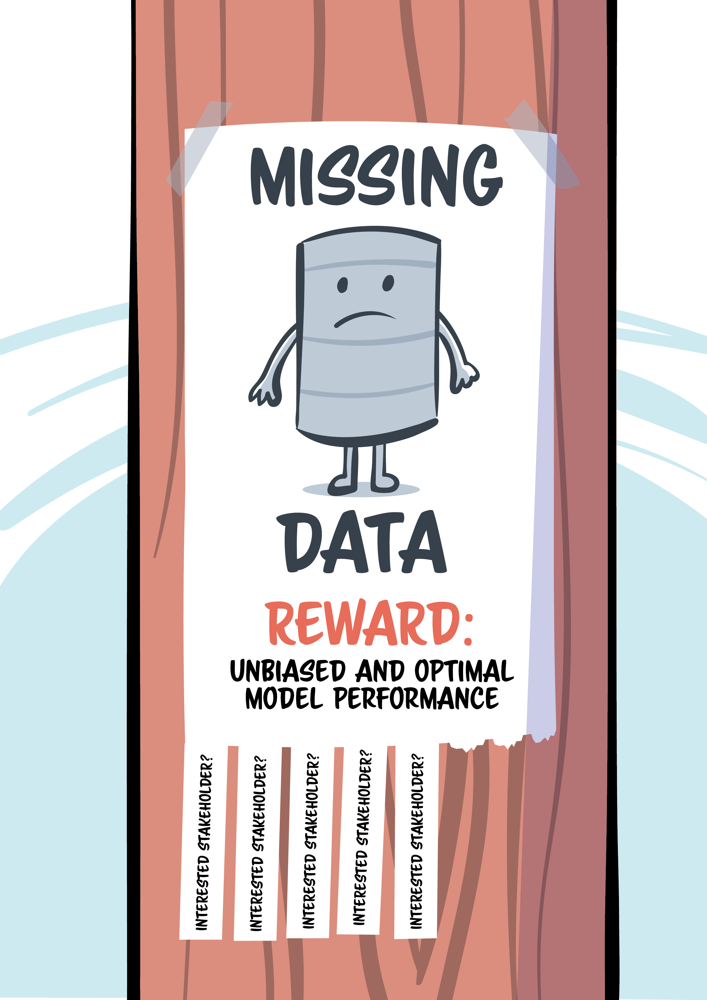

```{r setup}
library(mice)
library(ggmice)
library(ggplot2)
library(knitr)
library(xtable)
```

## Incomplete data

<br>
<br>

```{r}
dat <- data.frame(x = 1:5, y = c(0.1, 0.6, 0.8, NA, 0.3))
ggmice(dat, aes(x, y)) +
  geom_point(size = 3) +
  labs(x = "", y = "")
```

## Cursusoutline

1. Het probleem van missende data 
2. Multipele imputatie: het algemene idee
3. Correcte inferenties met missende data

## Take aways

1. Incomplete data kun je niet zomaar negeren
2. Missende data moet weerspiegeld worden met onzekerheid
3. Er is geen perfecte *quick fix*

## Cursuswebsite


[https://hanneoberman.github.io/antonius](https://hanneoberman.github.io/antonius){target="_blank"}

# Het probleem van missende data {background-color="#FFCD00"}

## Outline

- What is missing data?
- Strategies for dealing with missing data

## Missing data

{fig-align="center" width=20%}

## Definition

Missing values

- are those values that are not observed
- do exist in theory, but we are unable to see them

## Non-response

Missing values can occur at the cell/row/column level

- Item non-response: some, but not all, responses missing for a case
- Unit non-response: no observed response at all for a case 

## Loosing data

<!-- TODO: center image on slide -->

::: {.center}

```{mermaid}
%%| fig-width: 6.5
flowchart TD
  A[population] --> B((sample)) --> C([incomplete<br> sample])
  style C stroke:#f66,stroke-width:2px,stroke-dasharray: 5 5
```

:::


## Statistical inference framework

<!-- ::: {.columns} -->

<!-- :::: -->
- incomplete cases (e.g. drop-out)
- self-selection (e.g. opt-in sample)
- extrapolating beyond your data (e.g. prediction)

```{mermaid}
flowchart TD
  A[population] <--> B((sample))
```

## Causal inference framework

- missing variables (e.g. storks and babies)
- data which might have been (e.g. smoking and lung cancer)
- missing what matters (e.g. crashed planes)

```{mermaid}
flowchart LR
  A[cause] --> B[effect]
```

## Dark data

{fig-align="center" width=20%}

> Your theory may be perfectly sound for your data, but your data will have limits. ^[Hand 2020, p. 15]

## Definition

Dark data 

- are concealed from us 
- put us at risk 
    - of misunderstanding, 
    - of drawing incorrect conclusions, and 
    - of making poor decisions

## Intentionality

You can classify missing values in three groups

-   Missing values that should have been observed (unintentional)
-   Missing values that should not have been observed (intentional)
-   Missing values whose true value can be deduced from the observed data (deductive missings)

## Intentional missing data

Missing data caused by the design:

-   Taking a sample
-   Predicting a future outcome
-   Combining data from different sources
-   Estimating a causal effect

## Unintentional missing data

Missing data caused by the subject:

-   Dropout, refusal, concealed
-   Too far away, too small to observe
-   Power failure, budget exhausted, bad luck

## Intentionality and non-response

{height="600"}

## Incomplete sample

```{r}
dat <- data.frame(x = 1:5, y = c(0.1, 0.6, 0.8, NA, 0.3))
ggmice(dat, aes(x, y)) +
  geom_point() +
  labs(x = "", y = "")
```

## Missingness matrix

```{r}
dat <- data.frame(
  Y = c(1, 1, 1, NA, 1),
  X = rep(1, 5)
)
R <- data.frame(apply(!is.na(dat), 2, as.numeric))
long_R <- data.frame(
  row = 1:5,
  vrb = c(rep("Y", 5), rep("X", 5)),
  ind = as.numeric(!is.na(dat))
)
# plot
ggplot(long_R, aes(x = vrb, y = row, fill = as.factor(ind))) +
  geom_tile(color = "black") +
  scale_y_reverse() +
  scale_fill_manual(
    values = c(
      "1" = "#006CC2B3",
      "0" = "#B61A51B3"
    )
  ) +
  scale_x_discrete(position = "top") +
  coord_fixed(expand = FALSE) +
  ggmice:::theme_minimice() +
  labs(x = NULL, y = NULL, fill = "R")
```


## Strategies

> Sooner or later (usually sooner), anyone who does statistical analysis runs into problems with missing data^[Allison, 2002].

- Prevention
- Ignoring missing data
- Treating missing data

## Prevention

> Obviously the best way to treat missing data is not to have them^[Orchard and Woodbury, 1972].

-   Design: Short time intervals, low number of variables, test with pilot study
-   Collection: Incentives, match mode (e.g. interviewer-respondent), quick follow-up, retrieve missing data
-   Measures: Use short forms, minimize intrusive measures, maximize clarity, use supportive layout/UX design
-   Treatment: Minimize burden and intensity

## Ignoring missing data

Do nothing:
  -   Cannot calculate statistics, not even the mean

. . . 

Do "nothing":
  - Deletion-based methods are applied by default
  - Using only a complete subset of the data


## Strategies

- Prevention
- Ignoring missing data
- Treating missing data
    - Deletion-based methods
    - Weighting
    - Likelihood-based methods
    - Ad-hoc imputation methods
    - Multiple imputation

## Strategies

::: {.nonincremental}
- ~~Prevention~~
- ~~Ignoring missing data~~
- Treating missing data
    - Deletion-based methods
    - ~~Weighting~~ 
    - ~~Likelihood-based methods~~ 
    - Ad-hoc imputation methods
    - Multiple imputation
:::

## Deletion-based methods

-   List-wise deletion: 
    - Any row that contains missings are omitted from the analyses
    - Discards *all* cases with missing data
    - Reduces sample size
    - May introduce bias
    
-   Pair-wise deletion:
    - Incomplete pairs are not considered
    - Uses all available data for each analysis
    - Different analysis, different $n$
    - May introduce bias
    
    <!-- -   Less information than planned -->
    <!-- -   Enough statistical power? -->

## Listwise deletion

-   Analyze only the complete records
-   Also know as: complete-case analysis
-   Advantages
    -   Simple (default in most software)
    -   Unbiased only under strict conditions
    -   Conservative standard errors, significance levels
    -   Two special properties in regression

## Incomplete data

<br>
<br>

```{r}
dat <- data.frame(x = 1:5, y = c(0.1, 0.6, 0.8, NA, 0.3))
ggmice(dat, aes(x, y)) +
  geom_point(size = 3) +
  labs(x = "", y = "")
```

## Listwise deletion

-   Disadvantages
    -   Wasteful
    -   May not be possible
    -   Larger standard errors
    -   Biased under most conditions, even for simple statistics like the mean
    -   Inconsistencies in reporting

<!-- ## Listwise deletion: Special properties -->

<!-- -   For any regression with missing data in the predictors, estimates under listwise deletion are unbiased as long as the missingness does not depend on the outcome. Even some MNAR cases (Glynn 1986; Little 1992). -->
<!-- -   In logistic regression only: With missing data in either the outcome $Y$ or the predictors $X$ (but not both), estimates of regression weights (but not the intercept) after listwise deletion are unbiased as long as the missingness depends only on $Y$ (and not on $X$!) (Vach 1994). This property is widely exploited in case-control studies in epidemiology. -->
<!-- -   See FIMD 2.7: <https://stefvanbuuren.name/fimd/sec-when.html> -->

## Incomplete data

<br>
<br>

```{r}
dat <- data.frame(x = 1:5, y = c(0.1, 0.6, 0.8, NA, 0.3))
ggmice(dat, aes(x, y)) +
  geom_point(size = 3) +
  labs(x = "", y = "")
```

## Types of missingness

- Not data dependent 
  - It’s missing for reasons unrelated to the data
  - Probability to be missing is constant for all units
- Seen data dependent 
  - It’s missing for reasons related to data you have got
  - Probability to be missing depends on *observed* data 
- Unseen data dependent 
  - Missing because of the values you would have obtained
  - Probability to be missing depends on *unobserved* data 

## Missing data mechanisms in practice

- Survey data
- Variable of interest: income
- Income is missing for some people
- Age is observed for everyone

<!-- MCAR	Nothing (completely random)	Survey glitch causes random missing responses -->
<!-- MAR	Observed data	Younger people more likely to skip income question -->
<!-- MNAR	Unobserved (missing) data	High earners skip income question because of discomfort -->
```{r}
dat <- readRDS("data/income_2022_incomplete.rds")
```

## Complete data

```{r}
ggplot(dat, aes(x = age, y = income)) +
  geom_point(alpha = 0.5, color = mice::mdc(1), shape = 1) +
  theme_classic() +
  labs(y = "Income", x = "Age")
```

## Missing due to glitch

<!-- In a survey about political opinions, some respondents accidentally skip the last question because the survey software glitches randomly for a small group of users. The glitch affects people regardless of their age, political views, or any other characteristic. -->

<!-- Key Point: The missingness is like pure chance (e.g., technical errors, random loss of data), and it doesn’t bias the results if handled properly. -->


```{r}
ggplot(dat, aes(x = age, y = income, color = ind_mcar, shape = ind_mcar)) +
  geom_point(alpha = 0.5, size = 1, stroke = 1) +
  scale_color_manual(
    values = c("missing" = mice::mdc(2), "observed" = mice::mdc(1))
  ) +
  scale_shape_manual(values = c("missing" = 4, "observed" = 1)) +
  theme_classic() +
  labs(y = "Income", x = "Age", color = "", shape = "")
```


## Missing due to glitch

```{r}
ggplot(dat, aes(y = income, color = ind_mcar)) +
  geom_boxplot() +
  scale_color_manual(
    values = c("missing" = mice::mdc(2), "observed" = mice::mdc(1))
  ) +
  theme_classic() +
  labs(y = "Income", color = "")
```


## Missing due to glitch

```{r}
ggplot(dat, aes(y = income, color = ind_mcar)) +
  geom_density() +
  scale_color_manual(
    values = c("missing" = mice::mdc(2), "observed" = mice::mdc(1))
  ) +
  theme_classic() +
  labs(x = "Distribution", y = "Income", color = "")
```


## Missing lower ages


<!-- In a study on income levels, younger participants are more likely to skip the question about their annual income. However, among people of the same age group, the likelihood of skipping the question is unrelated to how much they actually earn. -->

<!-- Key Point: The missingness can be explained by other variables you’ve already collected (like age in this case). Statistical methods (like multiple imputation) can adjust for this. -->

```{r}
ggplot(dat, aes(x = age, y = income, color = ind_mar, shape = ind_mar)) +
  geom_point(alpha = 0.5, size = 1, stroke = 1) +
  scale_color_manual(
    values = c("missing" = mice::mdc(2), "observed" = mice::mdc(1))
  ) +
  scale_shape_manual(values = c("missing" = 4, "observed" = 1)) +
  theme_classic() +
  labs(y = "Income", x = "Age", color = "", shape = "")
```

## Missing lower ages

```{r}
ggplot(dat, aes(y = income, color = ind_mar)) +
  geom_boxplot() +
  scale_color_manual(
    values = c("missing" = mice::mdc(2), "observed" = mice::mdc(1))
  ) +
  theme_classic() +
  labs(y = "Income", color = "")
```

## Missing lower ages

```{r}
ggplot(dat, aes(y = income, color = ind_mar)) +
  geom_density() +
  scale_color_manual(
    values = c("missing" = mice::mdc(2), "observed" = mice::mdc(1))
  ) +
  theme_classic() +
  labs(x = "Distribution", y = "Income", color = "")
```

## Missing lower ages

```{r}
age_labs <- c("Age \u2264 35", "Age > 35")
names(age_labs) <- c(FALSE, TRUE)

ggplot(dat, aes(y = income, color = ind_mar)) +
  geom_density() +
  scale_color_manual(
    values = c("missing" = mice::mdc(2), "observed" = mice::mdc(1))
  ) +
  theme_classic() +
  labs(x = "Distribution", y = "Income", color = "") +
  facet_wrap(~ age > 35, nrow = 1, labeller = labeller(`age > 35` = age_labs))
```

## Missing higher incomes

<!-- In the same income survey, people with very high incomes are more likely to leave the income question blank because they feel uncomfortable disclosing it. Even after controlling for age, education, and other factors, the missingness is still related to the actual income, which is missing. -->

<!-- Key Point: The missingness depends on information you don’t have, making it the most challenging type. Advanced modeling or sensitivity analysis is often needed. -->


```{r}
ggplot(dat, aes(x = age, y = income, color = ind_mnar, shape = ind_mnar)) +
  geom_point(alpha = 0.5, size = 1, stroke = 1) +
  scale_color_manual(
    values = c("missing" = mice::mdc(2), "observed" = mice::mdc(1))
  ) +
  scale_shape_manual(values = c("missing" = 4, "observed" = 1)) +
  theme_classic() +
  labs(y = "Income", x = "Age", color = "", shape = "")
```

## Missing higher incomes

```{r}
ggplot(dat, aes(y = income, color = ind_mnar)) +
  geom_boxplot() +
  scale_color_manual(
    values = c("missing" = mice::mdc(2), "observed" = mice::mdc(1))
  ) +
  theme_classic() +
  labs(y = "Income", color = "")
```

## Missing higher incomes

```{r}
ggplot(dat, aes(y = income, color = ind_mnar)) +
  geom_density() +
  scale_color_manual(
    values = c("missing" = mice::mdc(2), "observed" = mice::mdc(1))
  ) +
  theme_classic() +
  labs(x = "Distribution", y = "Income", color = "")
```

<!-- ## Missing higher incomes -->

<!-- ```{r} -->
<!-- ggplot(dat, aes(y = income, color = ind_mnar)) + -->
<!--   geom_density() + -->
<!--   scale_color_manual(values = c("missing" = mice::mdc(2), "observed" = mice::mdc(1))) + -->
<!--   theme_classic() + -->
<!--   labs(x = "Distribution", y = "Income", color = "") + -->
<!--   facet_wrap(~age > 35, nrow = 1, labeller = labeller(`age > 35` = age_labs)) -->
<!-- ``` -->

## MCAR: Missing Completely at Random

-   Probability to be missing is not related to any data

-   Examples
    -   data transmission error
    -   random sample
    
## MCAR

```{r}
ggplot(dat, aes(x = age, y = income, color = ind_mcar, shape = ind_mcar)) +
  geom_point(alpha = 0.5, size = 1, stroke = 1) +
  scale_color_manual(
    values = c("missing" = mice::mdc(2), "observed" = mice::mdc(1))
  ) +
  scale_shape_manual(values = c("missing" = 4, "observed" = 1)) +
  theme_classic() +
  labs(y = "Income", x = "Age", color = "", shape = "")
```

## MAR: Missing at Random

-   Probability to be missing depends on known data

-   Examples
    -   Blood pressure, where we have $X$ related to health
    -   Branch patterns (e.g. how old are your children?)

## MAR

```{r}
ggplot(dat, aes(x = age, y = income, color = ind_mar, shape = ind_mar)) +
  geom_point(alpha = 0.5, size = 1, stroke = 1) +
  scale_color_manual(
    values = c("missing" = mice::mdc(2), "observed" = mice::mdc(1))
  ) +
  scale_shape_manual(values = c("missing" = 4, "observed" = 1)) +
  theme_classic() +
  labs(y = "Income", x = "Age", color = "", shape = "")
```

## MNAR: Missing Not at Random

-   Probability to be missing depends on unknown data

-   Examples
    -   Blood pressure, without covariates related to health
    -   Recreational drug use report

## MNAR

```{r}
ggplot(dat, aes(x = age, y = income, color = ind_mnar, shape = ind_mnar)) +
  geom_point(alpha = 0.5, size = 1, stroke = 1) +
  scale_color_manual(
    values = c("missing" = mice::mdc(2), "observed" = mice::mdc(1))
  ) +
  scale_shape_manual(values = c("missing" = 4, "observed" = 1)) +
  theme_classic() +
  labs(y = "Income", x = "Age", color = "", shape = "")
```

## Graphical representation


## Overview

-   **Missing Completely at Random** (MCAR/not data dependent)
    -   missingness is purely random
    -   relatively easy to deal with
-   **Missing at Random** (MAR/seen data dependent)
    -   missingness related to observed information
    -   widely used for principled analysis
-   **Missing Not at Random** (MNAR/unseen data dependent)
    -   missingness related to unobserved information
    -   cannot detect this from the data
    -   difficult to deal with, need context information

## Quizz

Under which condition would list-wise deletion *not* lead to biased estimates?

A. MCAR/not data dependent

B. MAR/seen data dependent

C. MNAR/unseen data dependent

## Strategies

::: {.nonincremental}
- ~~Prevention~~
- ~~Ignoring missing data~~
- Treating missing data
    - Deletion-based methods
    - ~~Weighting~~ 
    - ~~Likelihood-based methods~~ 
    - Ad-hoc imputation methods
    - Multiple imputation
:::

## Ad-hoc imputation methods

-   Mean imputation
-   Regression imputation
-   Last observation carried forward (LOCF)
-   Machine learning/deep learning models

## Ad hoc imputation in practice

Air quality dataset

```{r}
ggmice(airquality, aes(Solar.R, Ozone)) +
  geom_point(size = 2)
```

## Mean imputation

-   Replace the missing values by the mean of the observed data
-   Advantages
    -   Simple
    -   Unbiased only for the mean, under certain conditions
  
```{r duo = TRUE, fig.width=4.5, fig.height=2.25}
source("R/mi.hist.R")

## ----load, eval = FALSE--------------------------------------------------
suppressPackageStartupMessages(library("mice"))

## ----meanimp, echo=TRUE--------------------------------------------------
imp <- mice(airquality, method = "mean", m = 1, maxit = 1, print = FALSE)

## ----plotmeanimp, duo = TRUE, echo=FALSE, fig.width=4.5, fig.height=2.25----
lwd <- 0.6
data <- complete(imp)
Yobs <- airquality[, "Ozone"]
Yimp <- data[, "Ozone"]
mi.hist(
  Yimp,
  Yobs,
  b = seq(-20, 200, 10),
  type = "continuous",
  gray = F,
  lwd = lwd,
  obs.lwd = 1.5,
  mis.lwd = 1.5,
  imp.lwd = 1.5,
  obs.col = mdc(4),
  mis.col = mdc(5),
  imp.col = "transparent",
  mlt = 0.08,
  main = "",
  xlab = "Ozone (ppb)",
  axes = FALSE
)
box(lwd = 1)
```

## Mean imputation

```{r}
plot(
  data[cci(imp), 2:1],
  col = mdc(1),
  lwd = 1.5,
  ylab = "Ozone (ppb)",
  xlab = "Solar Radiation (lang)",
  ylim = c(-10, 170),
  axes = FALSE
)
points(data[ici(imp), 2:1], col = mdc(2), lwd = 1.5)
axis(1, lwd = lwd)
axis(2, lwd = lwd, las = 1)
box(lwd = 1)
```

## Mean imputation

-   Disadvantages
    -   Disturbs the distribution
    -   Underestimates the variance
    -   Biases correlations to zero
    -   Biased under MAR
-   AVOID (unless you know what you are doing)

## Regression imputation

-   Also known as **prediction**
    -   Fit model for observed data under listwise deletion
    -   Replace missing values by prediction
-   Advantages
    -   Unbiased estimates of regression coefficients under M(C)AR
    -   Good approximation to the (unknown) true data if explained variance is high
-   Favorite among data scientists and machine learners

## Regression imputation

```{r duo = TRUE, fig.width=4.5, fig.height=2.25}
## ----regimp, echo=TRUE---------------------------------------------------
fit <- lm(Ozone ~ Solar.R, data = airquality)
pred <- predict(fit, newdata = ic(airquality))

## ----plotregimp, duo = TRUE, echo=FALSE, fig.width=4.5, fig.height=2.25----
lwd <- 0.6
Yobs <- airquality[, "Ozone"]
Yimp <- Yobs
Yimp[ici(airquality)] <- pred
ss <- cci(airquality$Solar.R)
data <- data.frame(Ozone = Yimp, Solar.R = airquality$Solar.R)
mi.hist(
  Yimp[ss],
  Yobs[ss],
  b = seq(-20, 200, 10),
  type = "continuous",
  gray = F,
  lwd = lwd,
  obs.lwd = 1.5,
  mis.lwd = 1.5,
  imp.lwd = 1.5,
  obs.col = mdc(4),
  mis.col = mdc(5),
  imp.col = "transparent",
  mlt = 0.08,
  main = "",
  xlab = "Ozone (ppb)",
  axes = FALSE
)
box(lwd = 1)
```

## Regression imputation

```{r}
plot(
  data[cci(imp), 2:1],
  col = mdc(1),
  lwd = 1.5,
  ylab = "Ozone (ppb)",
  xlab = "Solar Radiation (lang)",
  ylim = c(-10, 170),
  axes = FALSE
)
points(data[ici(imp), 2:1], col = mdc(2), lwd = 1.5)
axis(1, lwd = lwd)
axis(2, lwd = lwd, las = 1)
box(lwd = 1)

```

## Regression imputation

-   Disadvantages
    -   Artificially increases correlations
    -   Systematically underestimates the variance
    -   Too optimistic $p$-values and too short confidence intervals
-   AVOID. Harmful to statistical inference

## Case study

```{r, echo=FALSE}
knitr::kable(
  tail(mice::nhanes),
  format = "markdown",
  row.names = FALSE,
  digits = 2
)
```

<br>


<!-- ## Stochastic regression imputation -->

<!-- -   Like regression imputation, but adds appropriate noise to the predictions to reflect uncertainty -->
<!-- -   Advantages -->
<!--     -   Preserves the distribution of $Y^\mathrm{obs}$ -->
<!--     -   Preserves the correlation between $Y$ and $X$ in the imputed data -->

<!-- ## Stochastic regression imputation -->

<!-- -   Disadvantages -->
<!--     -   Symmetric and constant error restrictive -->
<!--     -   Single imputation: does not take uncertainty imputed data into account, and incorrectly treats them as real -->
<!--     -   Not so simple anymore -->


## Cursuswebsite


[https://hanneoberman.github.io/antonius](https://hanneoberman.github.io/antonius){target="_blank"}


