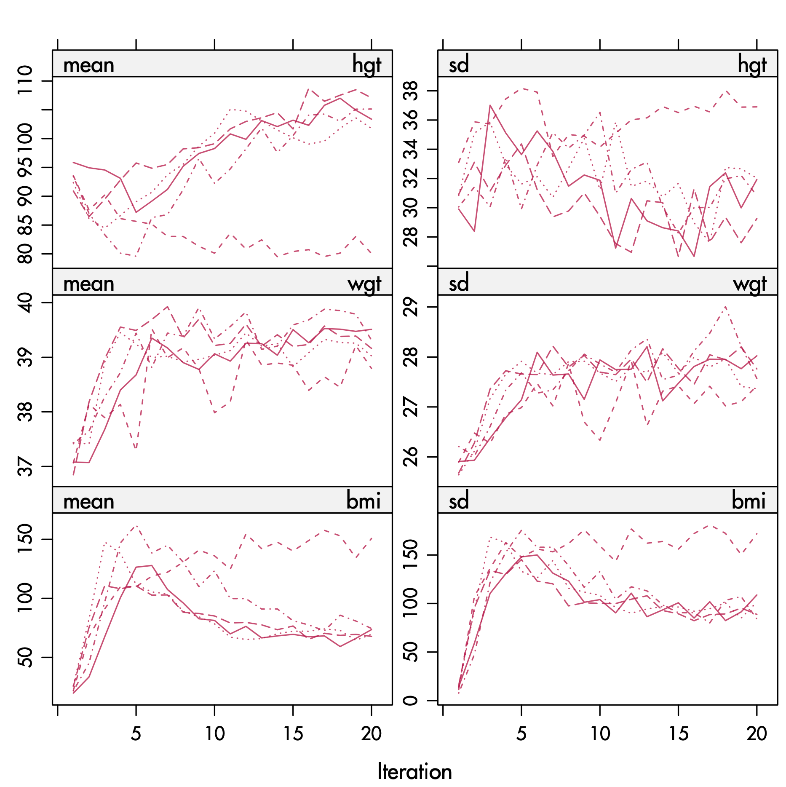
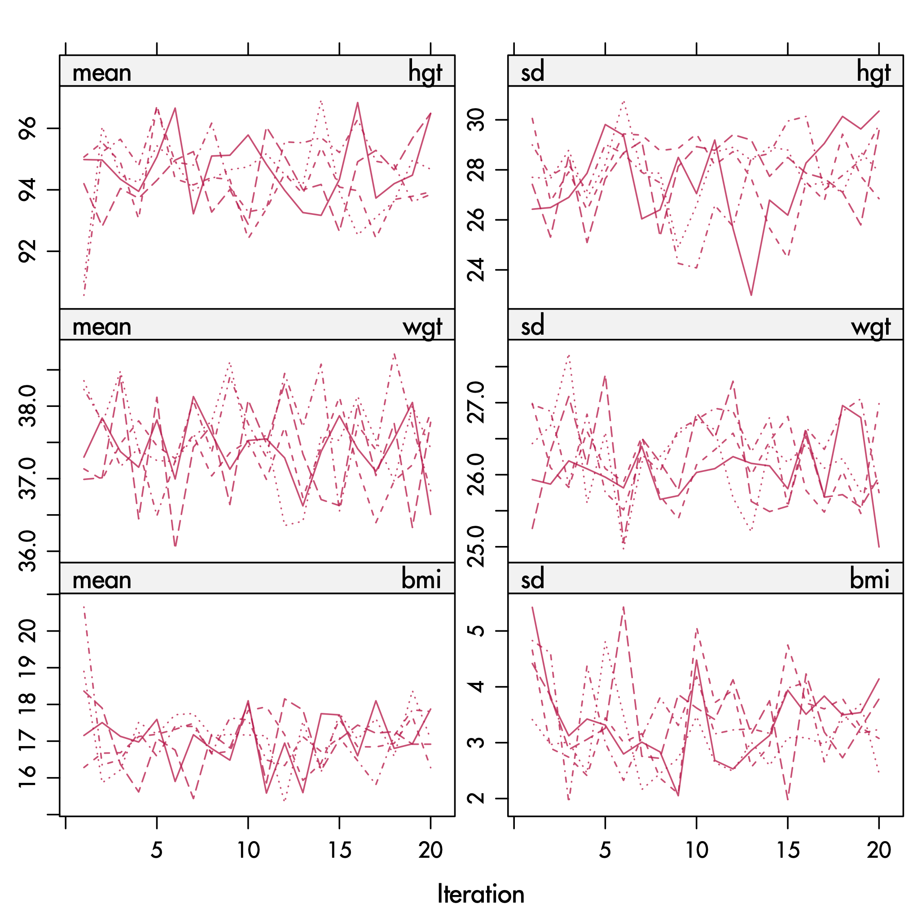

```{r setup}
library(mice)
library(ggmice)
library(ggplot2)
library(knitr)
library(xtable)
library(lattice)
source("R/mice.impute.normdump.R")
source("R/mice.impute.pmmdump.R")
data <- matrix(sample(1:100,4*8*3,replace=TRUE),nrow=8*4,
                dimnames=list(NULL,c("A","B","C")))
data <- as.data.frame(data)
data[c(31:32),"A"] <- NA
data[c(15:16,22:24,30:32),"B"] <- NA
data[c(6:8,12:16,17:21,27:29),"C"] <- NA
mdpat <- cbind(expand.grid(rec = 8:1, pat = 1:4, var = 1:3), r=as.numeric(as.vector(is.na(data))))
pattern1 <- data[1:8,]
pattern2 <- data[9:16,]
pattern3 <- data[17:24,]
pattern4 <- data[25:32,]
types <-  c("Univariate","Monotone","File matching","General")
```

## Outline

- How to generate multiple imputed data
  + If only variable has missing data
  + If many variables have missing data

## Multiple imputation

- **Core idea**: Replace each missing value by m > 1 plausible draws rather than a single estimate.
- **Uncertainty representation**: The variability across these draws reflects the inherent uncertainty about the unobserved true value.
- **Implementation**: For each missing cell, generate m imputations (e.g., m = 20), resulting in m completed datasets for downstream analysis.

## Multiple imputation workflow

<center>{height="600"}</center>

# Generating imputations {background-color="#2a76dd"}

## Relation temperature - gas

```{r gas_init}
data <- MASS::whiteside
lwd <- 1.5
```

```{r gas2}
plot(x = data$Temp, y = data$Gas, col = mice::mdc(1), lwd = lwd, 
     xlab=expression(paste("Temperature (", degree, "C)")),
     ylab="Gas consumption (cubic feet)")
```

## Delete gas, observation 47

```{r}
<<gas2>>
points(x=5, y=3.6, pch=4, cex=2, lwd=lwd, col=mdc(2))
legend(x="bottomleft", legend="deleted observation", pch=4, col=mdc(2), 
       pt.lwd=lwd, bty="n", pt.cex=2)
text(x=9, y=6.5, label="a",cex=2)
```

## Predict from regression line

```{r}
<<gas2>>
data[47,"Gas"] <- NA
abline(m1<-lm(Gas~Temp, data=data, na.action=na.omit), col=mdc(1))
points(5,4.04, lwd=lwd, col=mdc(2),pch=19)
text(x=9, y=6.5, label="b",cex=2)
```

## Prediction + noise

```{r}
<<gas2>>
imp <- mice(data, m=1, maxit=0)
pred <- imp$pred
pred["Gas","Insul"] <- 0
imp <- mice(data, m=5, pred=pred, meth="norm.nob", maxit=1, print=FALSE, seed=45433)
abline(m1<-lm(Gas~Temp, data=data, na.action=na.omit), col=mdc(1))
points(rep(5,5),imp$imp$Gas, lwd=lwd, col=mdc(2),pch=19)
text(x=9, y=6.5, label="c",cex=2)
```

## Prediction + noise + parameter draw

```{r}
<<gas2>>
imp <- mice(data, m=1, maxit=0)
pred <- imp$pred
pred["Gas","Insul"] <- 0
betadump <- vector("list", 0) 
imp <- mice(data, m=5, pred=pred, meth="normdump", maxit=1, print=FALSE, seed=83126)
abline(m1<-lm(Gas~Temp, data=data, na.action=na.omit), col=mdc(1))
betadump <- matrix(betadump, nc=2, byrow=T)
for (i in 1:5) abline(coef=unlist(betadump[i,]), col=mdc(2))
points(rep(5,5),imp$imp$Gas, lwd=lwd, col=mdc(2),pch=19)
text(x=9, y=6.5, label="d",cex=2)
```

## Imputation with two predictors

```{r}
pch <- c(rep(3,26),rep(1,30))
plot(x=data$Temp, y=data$Gas, col=mdc(1), lwd=lwd, pch=pch, 
     xlab=expression(paste("Temperature (", degree, "C)")), 
     ylab="Gas consumption (cubic feet)")
imp <- mice(data, m=5, meth="norm", maxit=1, print=FALSE, seed=11727)
abline(m1<-lm(Gas~Temp, data=data, na.action=na.omit, subset=Insul=="Before"), col=mdc(4))
abline(m2<-lm(Gas~Temp, data=data, na.action=na.omit, subset=Insul=="After"), col=mdc(4))
points(rep(5,5),imp$imp$Gas, lwd=lwd, col=mdc(2),pch=19)
legend(x="bottomleft", legend=c("before insulation","after insulation"), pch=c(3,1),bty="n", pt.lwd=lwd)
text(x=9, y=6.5, label="e",cex=2)  
```

## Drawing from observed data

```{r}
pch <- c(rep(3,26),rep(1,30))
plot(x=data$Temp, y=data$Gas, col=mdc(1), lwd=lwd, pch=pch, 
     xlab=expression(paste("Temperature (", degree, "C)")), 
     ylab="Gas consumption (cubic feet)")
betadump <- vector("list", 0) 
imp <- mice(data, m=5, meth="pmmdump", maxit=1, print=FALSE, seed=68006)
betadump <- matrix(betadump, nc=3, byrow=T)
m1<-lm(Gas~Temp+Insul, data=data, na.action=na.omit)
an <- coef(m1)[1]
ai <- an + coef(m1)[3]
b <- coef(m1)[2]
abline(a=ai, b=b, col=mdc(1))
abline(a=an, b=b, col=mdc(1))
## for (i in 1:1) {
##   abline(a=unlist(betadump[i,1]), b=unlist(betadump[i,2]), col=mdc(5))
##   abline(a=unlist(betadump[i,1])+unlist(betadump[i,3]), b=unlist(betadump[i,2]), col=mdc(5))
## }
## points(rep(5,5),imp$imp$Gas, lwd=lwd, col=mdc(2), pch=20) 
delta <- 0.6
ylo <- ai+b*(5-delta)
yhi <- ai+b*(5+delta)
lines(x=c(5-delta,5+delta),y=c(ylo,yhi),lwd=3,col=mdc(1))
xlo <- (ylo-an)/b
xhi <- (yhi-an)/b
lines(x=c(xlo,xhi),y=c(ylo,yhi),lwd=3,col=mdc(1))

donors <- subset(data, (Insul=="After"&Temp>5-delta&Temp<5+delta) 
                 |    (Insul=="Before"&Temp>xlo&Temp<xhi))
points(x=donors$Temp, y=donors$Gas, cex=1.8, col=mdc(2), lwd=lwd)
legend(x="bottomleft", legend=c("before insulation","after insulation"), pch=c(3,1),bty="n", pt.lwd=lwd)
text(x=9, y=6.5, label="f",cex=2)
```

## Predictive mean matching

```{r ppm0}
data <- MASS::whiteside
lwd <- 1.5
data[47,"Gas"] <- NA
```

```{r pmm1}
pch <- c(rep(3,26),rep(1,30))
plot(x=data$Temp, y=data$Gas, col=mdc(1), lwd=lwd, pch=pch, 
     xlab=expression(paste("Temperature (", degree, "C)")),
     ylab="Gas consumption (cubic feet)",
     xlim=c(-2,11), ylim=c(1,8), xaxs="i", yaxs="i")
legend(x="bottomleft", legend=c("before insulation","after insulation"), 
       pch=c(3,1),bty="n", pt.lwd=lwd)
```

## PMM: Add two regression lines

```{r pmm2}
<<pmm1>>
betadump <- vector("list", 0) 
imp <- mice(data, m=5, meth="pmmdump", maxit=1, print=FALSE, seed=68006)
betadump <- matrix(unlist(betadump), nc=3, byrow=T)
m1<-lm(Gas~Temp+Insul, data=data, na.action=na.omit)
an <- coef(m1)[1]
ai <- an + coef(m1)[3]
b <- coef(m1)[2]
abline(a=ai, b=b, col=mdc(4))
abline(a=an, b=b, col=mdc(4))
```

## PMM: Predicted at 5 degrees

```{r pmm3}
<<pmm2>>
yhat <- ai+b*5
lines(x=c(5,5),y=c(1.5,yhat), col=mdc(4), lwd=lwd)
arrows(5,yhat,-1,yhat, col=mdc(4), lwd=lwd)
points(-2, yhat, pch=9, col=mdc(1), cex=2)
points(5, 1, pch=9, col=mdc(1), cex=2)
xdelta <- 0.6
ylo <- ai+b*(5+xdelta)
yhi <- ai+b*(5-xdelta)
ydelta <- (yhi - ylo)/2
xlon <- (ylo-an)/b
xhin <- (yhi-an)/b
```

## PMM: Define matching range
```{r pmm4}
<<pmm2>>
points(-2, yhat, pch=9, col=mdc(1), cex=2)
points(5, 1, pch=9, col=mdc(1), cex=2)
abline(h=c(ylo,yhi),col=mdc(4),lty=3)
lines(x=c(5-xdelta,5+xdelta),y=c(yhi,ylo),lwd=3,col=mdc(4))
lines(x=c(xhin,xlon),y=c(yhi,ylo),lwd=3,col=mdc(4))
```

## PMM: Select potential donors
```{r pmm5}
<<pmm4>>
# abline(v=c(5-xdelta,5+xdelta), col=mdc(4),lty=3)
donors <- subset(data, (Insul=="After"&Temp>5-xdelta&Temp<5+xdelta) 
                 |    (Insul=="Before"&Temp>xhin&Temp<xlon))
points(x=donors$Temp, y=donors$Gas, cex=1.8, col=mdc(5), lwd=lwd)
```


## PMM: Bayesian PMM: Draw lines
```{r pmm6}
<<pmm2>>
# draw a line
an <- 7.05; ai<-an-1.7; b <- -0.38
xlo1 <- (ylo-ai)/b
xhi1 <- (yhi-ai)/b
xlo2 <- (ylo-an)/b
xhi2 <- (yhi-an)/b

abline(a=an, b=b, col=mdc(5))
abline(a=ai, b=b, col=mdc(5))
```

## PMM: Define a matching range
```{r pmm7}
<<pmm6>>
points(-2, yhat, pch=9, col=mdc(1), cex=2)
points(5, 1, pch=9, col=mdc(1), cex=2)
abline(h=c(ylo,yhi),col=mdc(4),lty=3)
lines(x=c(xlo1,xhi1),y=c(ylo,yhi),lwd=3,col=mdc(5))
lines(x=c(xlo2,xhi2),y=c(ylo,yhi),lwd=3,col=mdc(5))
```

## PMM: Select potential donors
```{r pmm8}
<<pmm7>>
donors <- subset(data, (Insul=="After"&Temp>xhi1&Temp<xlo1) 
                 |    (Insul=="Before"&Temp>xhi2&Temp<xlo2))
points(x=donors$Temp, y=donors$Gas, cex=1.8, col=mdc(5), lwd=lwd)
```

## Imputation of binary variable
- Logistic regression
$$\Pr(y_i=1|X_i, \beta) = \frac{\exp(X_i\beta)}{1+\exp(X_i\beta)}$$

## Fit logistic model
```{r lr}
x <- seq(-3,3,0.1)
p1 <- exp(x)/(1+exp(x))
p2 <- exp(x)*0.9/(1+exp(x)*0.9)
plot(x,p1,type="l",xlab="Linear predictor", ylab="Probability",
     ylim=c(0,1),col=mdc(1),lwd=2)
```

## Draw parameter estimate
```{r lr2}
<<lr>>
points(x,p2, type="l",col=mdc(2))
```

## Read off the probability
```{r lr3}
<<lr2>>
y <- exp(1)*0.9/(1+exp(1)*0.9)
arrows(x0=1,y0=0,x1=1,y1=y,code="3",col=mdc(2),length=0.1)
arrows(x0=1,y0=y,x1=1,y1=1,code="3",col=mdc(2),length=0.1)
text(labels=1:2, x=0.7, y=c((1+y)/2, y/2), cex=2,
     col=mdc(2))

lines(x=c(-4,1),y=c(1,1),col=mdc(2),lty=2)
lines(x=c(-4,1),y=c(y,y),col=mdc(2),lty=2)
lines(x=c(-4,1),y=c(0,0),col=mdc(2),lty=2)
```


## Impute ordered categorical variable

- $K$ ordered categories $k=1,\dots,K$
- *ordered logit model*, or
- *proportional odds model*
$$\Pr(y_i=k|X_i, \beta) = \frac{\exp(\tau_k + X_i\beta)}{\sum_{k=1}^K\exp(\tau_k + X_i\beta)}$$
-

## Fit ordered logit model

```{r polr}
x <- seq(-3,3,0.1)
p1 <- exp(x)*(1/3)/(1+exp(x)*(1/3))
p2 <- exp(x)*3/(1+exp(x)*3)
plot(x,p1,type="l",xlab="Linear predictor", ylab="Probability",ylim=c(0,1),col=mdc(1),lwd=2)
points(x,p2,type="l",col=mdc(1),lwd=2)
```

## Read off the probability

```{r polr2}
<<polr>>
arrows(x0=1,y0=0,x1=1,y1=p1[41],code="3",col=mdc(2),length=0.1)
arrows(x0=1,y0=p1[41],x1=1,y1=p2[41],code="3",col=mdc(2),length=0.1)
arrows(x0=1,y0=p2[41],x1=1,y1=1,code="3",col=mdc(2),length=0.1)
text(labels=1:3, x=0.7, y=c((1+p2[41])/2, (p1[41]+p2[41])/2, p1[41]/2), cex=2,
     col=mdc(2))
lines(x=c(1,-4),y=c(1,1), col=mdc(2),lty=2)
lines(x=c(1,-4),y=c(p2[41],p2[41]), col=mdc(2),lty=2)
lines(x=c(1,-4),y=c(p1[41],p1[41]), col=mdc(2), lty=2)
lines(x=c(1,-4),y=c(0,0), col=mdc(2), lty=2)
```

## Built-in imputation functions

<https://amices.org/mice/reference/index.html>

# Generating imputations, multivariate {background-color="#2a76dd"}

## Issues in multivariate imputation {#sec:issues}

::: {.small}
-   The predictors $Y_{-j}$ themselves can contain missing
    values;
-   “Circular” dependence can occur, where $Y_j^\mathrm{mis}$
    depends on $Y_h^\mathrm{mis}$, and vice versa;
-   Variables are often of different types (e.g., binary,
    unordered, ordered, continuous);
-   Especially with large $p$ and small $n$, collinearity or empty
    cells can occur;
-   The ordering of the rows and columns can be meaningful, e.g.,
    as in longitudinal data;
-   The relation between $Y_j$ and predictors $Y_{-j}$ can be
    complex, e.g., nonlinear, or subject to censoring processes;
-   Imputation can create impossible combinations.
:::

## Fully conditional specification

```{r, fig.align='center'}
data <- expand.grid(rec = 1:8, var = 1:3)
data$r <- c(rep(3, 2), rep(1, 6), rep(3, 3), rep(1, 5), rep(1, 3), rep(3, 5))
levelplot(
  r ~ var + rec,
  data = data,
  as.table = FALSE,
  aspect = "iso",
  shrink = c(0.9),
  col.regions = c(mdc(1), mdc(2), "grey90"),
  cuts = 2,
  colorkey = FALSE,
  scales = list(draw = FALSE),
  xlab = "",
  ylab = "",
  between = list(x = 1, y = 0),
  strip = strip.custom(bg = "grey95", style = 1, factor.levels = types)
)
```


## Fully conditional specification

```{r, fig.align='center'}
data <- expand.grid(rec = 1:8, var = 1:3)
data$r <- c(rep(4, 2), rep(1, 6), rep(4, 3), rep(1, 5), rep(1, 3), rep(4, 5))
levelplot(
  r ~ var + rec,
  data = data,
  as.table = FALSE,
  aspect = "iso",
  shrink = c(0.9),
  col.regions = c(mdc(1), mdc(2), "grey90", hcl(0, 100, 40, 0.3)),
  cuts = 2,
  colorkey = FALSE,
  scales = list(draw = FALSE),
  xlab = "",
  ylab = "",
  between = list(x = 1, y = 0),
  strip = strip.custom(bg = "grey95", style = 1, factor.levels = types)
)
```

## Fully conditional specification

```{r, fig.align='center'}
data <- expand.grid(rec = 1:8, var = 1:3)
data$r <- c(rep(2, 2), rep(1, 6), rep(4, 3), rep(1, 5), rep(1, 3), rep(4, 5))
levelplot(
  r ~ var + rec,
  data = data,
  as.table = FALSE,
  aspect = "iso",
  shrink = c(0.9),
  col.regions = c(mdc(1), mdc(2), "grey90", hcl(0, 100, 40, 0.3)),
  cuts = 2,
  colorkey = FALSE,
  scales = list(draw = FALSE),
  xlab = "",
  ylab = "",
  between = list(x = 1, y = 0),
  strip = strip.custom(bg = "grey95", style = 1, factor.levels = types)
)
```

## Fully conditional specification

```{r, fig.align='center'}
data <- expand.grid(rec = 1:8, var = 1:3)
data$r <- c(rep(2, 2), rep(1, 6), rep(2, 3), rep(1, 5), rep(1, 3), rep(4, 5))
levelplot(
  r ~ var + rec,
  data = data,
  as.table = FALSE,
  aspect = "iso",
  shrink = c(0.9),
  col.regions = c(mdc(1), mdc(2), "grey90", hcl(0, 100, 40, 0.3)),
  cuts = 2,
  colorkey = FALSE,
  scales = list(draw = FALSE),
  xlab = "",
  ylab = "",
  between = list(x = 1, y = 0),
  strip = strip.custom(bg = "grey95", style = 1, factor.levels = types)
)
```

## Fully conditional specification

```{r, fig.align='center'}
data <- expand.grid(rec = 1:8, var = 1:3)
data$r <- c(rep(2, 2), rep(1, 6), rep(2, 3), rep(1, 5), rep(1, 3), rep(2, 5))
levelplot(
  r ~ var + rec,
  data = data,
  as.table = FALSE,
  aspect = "iso",
  shrink = c(0.9),
  col.regions = c(mdc(1), mdc(2)),
  cuts = 1,
  colorkey = FALSE,
  scales = list(draw = FALSE),
  xlab = "",
  ylab = "",
  between = list(x = 1, y = 0),
  strip = strip.custom(bg = "grey95", style = 1, factor.levels = types)
)
```

## Fully conditional specification - next

```{r, fig.align='center'}
data <- expand.grid(rec = 1:8, var = 1:3)
data$r <- c(rep(4, 2), rep(1, 6), rep(4, 3), rep(1, 5), rep(1, 3), rep(4, 5))
levelplot(
  r ~ var + rec,
  data = data,
  as.table = FALSE,
  aspect = "iso",
  shrink = c(0.9),
  col.regions = c(mdc(1), mdc(2), "grey90", hcl(0, 100, 40, 0.3)),
  cuts = 2,
  colorkey = FALSE,
  scales = list(draw = FALSE),
  xlab = "",
  ylab = "",
  between = list(x = 1, y = 0),
  strip = strip.custom(bg = "grey95", style = 1, factor.levels = types)
)
```

## Fully conditional specification - next

```{r, fig.align='center'}
data <- expand.grid(rec = 1:8, var = 1:3)
data$r <- c(rep(2, 2), rep(1, 6), rep(4, 3), rep(1, 5), rep(1, 3), rep(4, 5))
levelplot(
  r ~ var + rec,
  data = data,
  as.table = FALSE,
  aspect = "iso",
  shrink = c(0.9),
  col.regions = c(mdc(1), mdc(2), "grey90", hcl(0, 100, 40, 0.3)),
  cuts = 2,
  colorkey = FALSE,
  scales = list(draw = FALSE),
  xlab = "",
  ylab = "",
  between = list(x = 1, y = 0),
  strip = strip.custom(bg = "grey95", style = 1, factor.levels = types)
)
```

## How many iterations?

- Quick convergence
- 5--10 iterations is adequate for most problems
- More iterations is $\lambda$ is high
- Inspect the generated imputations
- Monitor convergence to detect anomalies

## Non-convergence

<center>
{height="600px"}
</center>

## Convergence

<center>
{height="600px"}
</center>

## Number of iterations

Watch out for situations where

- the correlations between the $Y_j$'s are high;
- the missing data rates are high; or
- constraints on parameters across different variables exist.


# Case study {background-color="#2a76dd"}

<!-- ## Case study -->

<!-- ```{r, echo=FALSE} -->
<!-- knitr::kable(tail(mice::nhanes), format = "markdown", row.names = FALSE, digits = 2) -->
<!-- ``` -->

<!-- <br> -->

<!--  -->


## NHANES data (excerpt)

```{r, echo=FALSE}
knitr::kable(tail(mice::nhanes), format = "markdown", row.names = FALSE, digits = 2)
```

<br>


## Missing cholesterol

```{r}
ggmice(nhanes, aes(age, chl)) +
  geom_point()
```


## Multiple imputation workflow

<center>{height="600"}</center>

## Incomplete data

```{r, echo=FALSE}
knitr::kable(tail(mice::nhanes), format = "markdown", row.names = FALSE, digits = 2)
```

<br>


<!--  -->

## Incomplete data

```{r, echo=FALSE, warning=FALSE, message=FALSE}
ggmice(nhanes, aes(age, chl)) + 
  geom_point(size = 2, shape = 1, stroke = 2, position = position_jitter(seed = 42, height = 0, width = 0.1)) +
  scale_x_continuous(limits = c(0.5, 3.5)) +
  labs(x = "Age (1 = 20-39, 2 = 40-59, 3 = 60+ years old)",
       y = "Cholesterol (mg/dL)")
```

## Multiple imputation workflow

<center>{height="600"}</center>


## Imputed data (1)

::: {.columns}

:::: {.column width="40%"}

```{r, echo=FALSE}
imp <- mice(nhanes, m = 3, printFlag = FALSE, seed = 3)
knitr::kable(tail(complete(imp, 1)), row.names = FALSE, digits = 2)
```

::::

:::: {.column width="60%"}

```{r, fig.width=6, fig.height=6, echo=FALSE}
gg <- m1 <- m2 <- m3 <- ggmice(imp, aes(age, chl)) +
  geom_point(size = 2, shape = 1, stroke = 2, position = position_jitter(seed = 42, height = 0, width = 0.1)) +
  scale_x_continuous(limits = c(0.5, 3.5)) +
  labs(x = "Age (1 = 20-39, 2 = 40-59, 3 = 60+ years old)",
       y = "Cholesterol (mg/dL)")
m1$data <- gg$data |> filter(.imp == 0 | .imp == 1)
m1 # + geom_smooth(method = "lm", formula = 'y ~ x', color = mice::mdc(2))
```

::::
:::

## Imputed data (2)

::: {.columns}

:::: {.column width="40%"}

```{r, echo=FALSE}
knitr::kable(tail(complete(imp, 2)), row.names = FALSE, digits = 2)
```

::::

:::: {.column width="60%"}

```{r, fig.width=6, fig.height=6, echo=FALSE}
m2$data <- gg$data |> filter(.imp == 0 | .imp == 2)
m2 # + geom_smooth(method = "lm", formula = 'y ~ x', color = mice::mdc(2))
```

::::
:::

## Imputed data (3)

::: {.columns}

:::: {.column width="40%"}

```{r, echo=FALSE}
knitr::kable(tail(complete(imp, 3)), row.names = FALSE, digits = 2)
```

::::

:::: {.column width="60%"}

```{r, fig.width=6, fig.height=6, echo=FALSE}
m3$data <- gg$data |> filter(.imp == 0 | .imp == 3)
m3 
```

::::
:::

## Multiple imputation workflow

<center>{height="600"}</center>


## Software


## Inspect the data

```{r echo=TRUE}
library(mice)
head(nhanes)
```

<br> <br>

```r
?nhanes
```

## Inspect missing data pattern

```{r, echo=TRUE, fig.align='center'}
plot_pattern(nhanes)
```

## Multiply impute the data

```{r echo=TRUE}
imp <- mice(nhanes, print = FALSE, seed = 24415)
imp
```

## Inspect imputation models

```{r echo=TRUE}
plot_pred(imp)
```

## Stripplot observed vs imputed data

```{r echo=TRUE}
stripplot(imp, pch = 20, cex = 1.2)
```

## `ggmice(imp, aes(.imp, chl)) + geom_point()`

```{r}
ggmice(imp, aes(x = .imp, y = chl)) + 
  geom_point() +
  labs(x = "Imputation number (0 = observed)")
```

## `ggmice(imp, aes(.imp, chl)) + geom_boxplot()`

```{r}
ggmice(imp, aes(x = .imp, y = chl)) + 
  geom_boxplot() +
  labs(x = "Imputation number (0 = observed)")
```

## `ggmice(imp, ...) + geom_jitter() + geom_boxplot()`

```{r}
ggmice(imp, aes(x = .imp, y = chl)) + 
  geom_jitter(width = 0.35, height = 0) +
  geom_boxplot(alpha = 0.5, outlier.alpha = 0) +
  labs(x = "Imputation number (0 = observed)")
```

## `ggmice(imp, aes(age, chl)) + geom_point()`

```{r}
library(plotly)
gg <- ggmice(imp, aes(x = age, y = chl)) + 
  geom_point()
ggplotly(gg, tooltip = "chl")
```


## Fit the complete-data model

```{r echo=TRUE}
fit <- with(imp, lm(chl ~ age))
```


```{r echo=TRUE}
fit$analyses[[1]]
fit$analyses[[2]]
```

## Pool the analyses

```{r echo=TRUE}
est <- pool(fit)
summary(est)
```

## Take aways

- Generating univariate imputations adds noise
- Generating multivariate imputatation iterates over univariate method
- Library of univariate imputation functions in `mice`
- Visualize the imputation process using `ggmice()`
