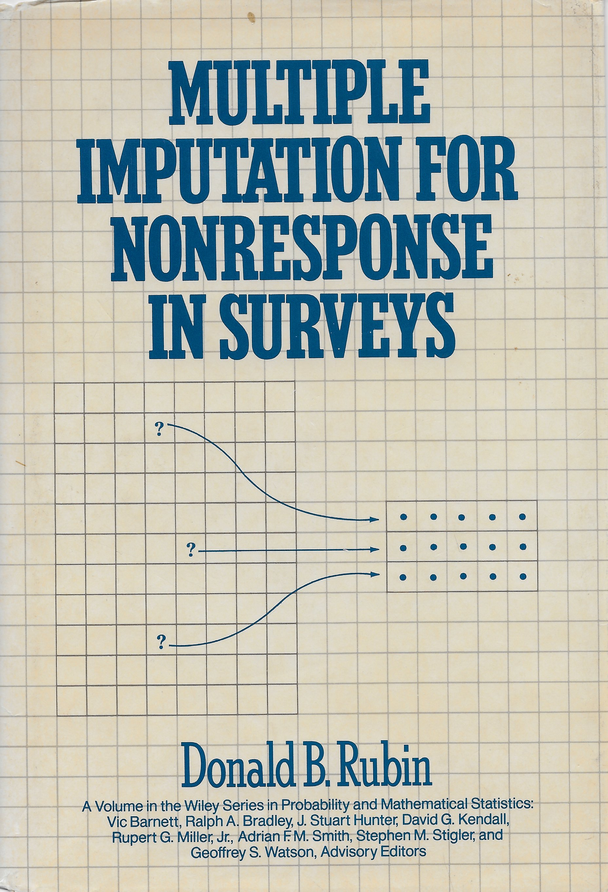

```{r setup}
library(mice)
library(ggmice)
library(ggplot2)
library(knitr)
library(xtable)
```

## Recap

- What is missing data?
- Strategies for dealing with missing data

## Incomplete sample

```{r}
dat <- data.frame(x = 1:5, y = c(0.1, 0.6, 0.8, NA, 0.3))
ggmice(dat, aes(x,y)) +
  geom_point() +
  labs(x = "", y = "")
```

## Missingness matrix

```{r}
dat <- data.frame(
  Y = c(1, 1, 1, NA, 1),
  X = rep(1, 5)
)
R <- data.frame(apply(!is.na(dat), 2, as.numeric))
long_R <- data.frame(row = 1:5, vrb = c(rep("Y", 5), rep("X", 5)), ind = as.numeric(!is.na(dat)))
# plot
ggplot(long_R, aes(x = vrb, y = row, fill = as.factor(ind))) +
  geom_tile(color = "black") +
  scale_y_reverse() +
  scale_fill_manual(values = c(
    "1" = "#006CC2B3",
    "0" = "#B61A51B3"
  )) +
  scale_x_discrete(position = "top") +
  coord_fixed(expand = FALSE) +
  ggmice:::theme_minimice() +
  labs(x = NULL, y = NULL, fill = "R")
```

## Strategies

::: {.nonincremental}
- ~~Prevention~~
- ~~Ignoring missing data~~
- Treating missing data
    - Deletion-based methods
    - ~~Weighting~~ 
    - ~~Likelihood-based methods~~ 
    - Ad-hoc imputation methods
    - Multiple imputation
:::

# Multipele imputatie: <br> het algemene idee {background-color="#FFCD00"}

## Outline

- What is multiple imputation?
- How can you use multiple imputation?

## Multiple imputation

-   Missing values may be 'imputed', i.e. filled in
-   One imputation cannot be correct in general
-   Therefore, impute each missing value $m$ times
-   Variation between the $m$ imputed values reflects our ignorance about the unknown value

## Multiple imputation workflow

<center>{height="600"}</center>

## Multiple imputation - 1987




## Multiple imputation

Advantages:

-   Correct point and variance estimates
-   Splits missing data problem from complete-data analysis
-   Theoretical properties well established
-   Flexible, widely applicable

. . . 

Disadvantages:

-   Need to create and work with multiple imputed data sets
-   May not always be most efficient


## Multiple imputation in practice

Data: `MASS::whiteside`

```{r gas-init}
library(MASS)
data <- MASS::whiteside
lwd <- 1.5
```

```{r gas2, fig.height=7, fig.align='center', error=TRUE}
plot(x = data$Temp, y = data$Gas, col = mice:::mdc(1), lwd = lwd, 
     xlab=expression(paste("Temperature (", degree, "C)")), 
     ylab="Gas consumption (cubic feet)")
```

## Delete gas consumption of one case

```{r, fig.height=7, fig.align='center', error=TRUE}
<<gas2>>
points(x=5, y=3.6, pch=4, cex=2, lwd=lwd, col=mice:::mdc(2))
legend(x="bottomleft", legend="deleted observation", pch=4, col=mice:::mdc(2), 
       pt.lwd=lwd, bty="n", pt.cex=2)
text(x=9, y=6.5, label="a",cex=2)
```

## Predict from regression line

```{r, fig.height=7, fig.align='center', error=TRUE}
<<gas2>>
data[47,"Gas"] <- NA
abline(m1<-lm(Gas~Temp, data=data, na.action=na.omit), col=mice:::mdc(1))
points(5,4.04, lwd=lwd, col=mice:::mdc(2),pch=19)
text(x=9, y=6.5, label="b",cex=2)
```

## Stochastic regresson imputation (SRI)

```{r, fig.height=7, fig.align='center', error=TRUE}
<<gas2>>
imp <- mice(data, m=1, maxit=0)
pred <- imp$pred
pred["Gas","Insul"] <- 0
imp <- mice(data, m=5, pred=pred, meth="norm.nob", maxit=1, print=FALSE, seed=45433)
abline(m1<-lm(Gas~Temp, data=data, na.action=na.omit), col=mice:::mdc(1))
points(rep(5,5),imp$imp$Gas, lwd=lwd, col=mice:::mdc(2),pch=19)
text(x=9, y=6.5, label="c",cex=2)
```

## SRI + parameter uncertainty (Bayesian)

```{r, fig.height=7, fig.align='center', error=TRUE}
<<gas2>>
imp <- mice(data, m=1, maxit=0)
pred <- imp$pred
pred["Gas","Insul"] <- 0
betadump <- vector("list", 0) 
imp <- mice(data, m=5, pred=pred, meth="norm", maxit=1, print=FALSE, seed=83126)
abline(m1<-lm(Gas~Temp, data=data, na.action=na.omit), col=mice:::mdc(1))
betadump <- matrix(betadump, nc=2, byrow=T)
points(rep(5,5),imp$imp$Gas, lwd=lwd, col=mice:::mdc(2),pch=19)
text(x=9, y=6.5, label="d",cex=2)
```

## Bayesian SRI with two predictors

```{r, fig.height=7, fig.align='center', error=TRUE}
pch <- c(rep(3,26),rep(1,30))
plot(x=data$Temp, y=data$Gas, col=mice:::mdc(1), lwd=lwd, pch=pch, 
     xlab=expression(paste("Temperature (", degree, "C)")), 
     ylab="Gas consumption (cubic feet)")
imp <- mice(data, m=5, meth="norm", maxit=1, print=FALSE, seed=11727)
abline(m1<-lm(Gas~Temp, data=data, na.action=na.omit, subset=Insul=="Before"), col=mice:::mdc(4))
abline(m2<-lm(Gas~Temp, data=data, na.action=na.omit, subset=Insul=="After"), col=mice:::mdc(4))
points(rep(5,5),imp$imp$Gas, lwd=lwd, col=mice:::mdc(2),pch=19)
legend(x="bottomleft", legend=c("before insulation","after insulation"), pch=c(3,1),bty="n", pt.lwd=lwd)
text(x=9, y=6.5, label="e",cex=2)  
```

## Predictive mean matching (PMM)

```{r ppm0}
data <- whiteside
lwd <- 1.5
data[47,"Gas"] <- NA
```

```{r pmm1, fig.height=7, fig.align='center', error=TRUE}
pch <- c(rep(3,26),rep(1,30))
plot(x=data$Temp, y=data$Gas, col=mice:::mdc(1), lwd=lwd, pch=pch, 
     xlab=expression(paste("Temperature (", degree, "C)")),
     ylab="Gas consumption (cubic feet)",
     xlim=c(-2,11), ylim=c(1,8), xaxs="i", yaxs="i")
legend(x="bottomleft", legend=c("before insulation","after insulation"), 
       pch=c(3,1),bty="n", pt.lwd=lwd)
```

## PMM: Add two regression lines

```{r pmm2, fig.height=7, fig.align='center', error=TRUE}
<<pmm1>>
betadump <- vector("list", 0) 
imp <- mice(data, m=5, meth="pmm", maxit=1, print=FALSE, seed=68006)
# betadump <- matrix(unlist(betadump), nc=3, byrow=T)
m1<-lm(Gas~Temp+Insul, data=data, na.action=na.omit)
an <- coef(m1)[1]
ai <- an + coef(m1)[3]
b <- coef(m1)[2]
abline(a=ai, b=b, col=mice:::mdc(4))
abline(a=an, b=b, col=mice:::mdc(4))
```

## PMM: Predict from two factors

```{r pmm3, fig.height=7, fig.align='center', error=TRUE}
<<pmm2>>
yhat <- ai+b*5
lines(x=c(5,5),y=c(1.5,yhat), col=mice:::mdc(4), lwd=lwd)
arrows(5,yhat,-1,yhat, col=mice:::mdc(4), lwd=lwd)
points(-2, yhat, pch=9, col=mice:::mdc(1), cex=2)
points(5, 1, pch=9, col=mice:::mdc(1), cex=2)
xdelta <- 0.6
ylo <- ai+b*(5+xdelta)
yhi <- ai+b*(5-xdelta)
ydelta <- (yhi - ylo)/2
xlon <- (ylo-an)/b
xhin <- (yhi-an)/b
```

## PMM: Define a matching range

```{r pmm4, fig.height=7, fig.align='center', error=TRUE}
<<pmm2>>
points(-2, yhat, pch=9, col=mice:::mdc(1), cex=2)
points(5, 1, pch=9, col=mice:::mdc(1), cex=2)
abline(h=c(ylo,yhi),col=mice:::mdc(4),lty=3)
lines(x=c(5-xdelta,5+xdelta),y=c(yhi,ylo),lwd=3,col=mice:::mdc(4))
lines(x=c(xhin,xlon),y=c(yhi,ylo),lwd=3,col=mice:::mdc(4))
```

## PMM: Select potential donors

```{r pmm5, fig.height=7, fig.align='center', error=TRUE}
<<pmm4>>
# abline(v=c(5-xdelta,5+xdelta), col=mice:::mdc(4),lty=3)
donors <- subset(data, (Insul=="After"&Temp>5-xdelta&Temp<5+xdelta) 
                 |    (Insul=="Before"&Temp>xhin&Temp<xlon))
points(x=donors$Temp, y=donors$Gas, cex=1.8, col=mice:::mdc(5), lwd=lwd)
```

## Bayesian PMM: Draw a line

```{r pmm6, fig.height=7, fig.align='center', error=TRUE}
<<pmm2>>
# draw a line
an <- 7.05; ai<-an-1.7; b <- -0.38
xlo1 <- (ylo-ai)/b
xhi1 <- (yhi-ai)/b
xlo2 <- (ylo-an)/b
xhi2 <- (yhi-an)/b

abline(a=an, b=b, col=mice:::mdc(5))
abline(a=ai, b=b, col=mice:::mdc(5))
```

## PMM: Define a matching range

```{r pmm7, fig.height=7, fig.align='center', error=TRUE}
<<pmm6>>
points(-2, yhat, pch=9, col=mice:::mdc(1), cex=2)
points(5, 1, pch=9, col=mice:::mdc(1), cex=2)
abline(h=c(ylo,yhi),col=mice:::mdc(4),lty=3)
lines(x=c(xlo1,xhi1),y=c(ylo,yhi),lwd=3,col=mice:::mdc(5))
lines(x=c(xlo2,xhi2),y=c(ylo,yhi),lwd=3,col=mice:::mdc(5))
```

## PMM: Select potential donors

```{r pmm8, fig.height=7, fig.align='center', error=TRUE}
<<pmm7>>
donors <- subset(data, (Insul=="After"&Temp>xhi1&Temp<xlo1) 
                 |    (Insul=="Before"&Temp>xhi2&Temp<xlo2))
points(x=donors$Temp, y=donors$Gas, cex=1.8, col=mice:::mdc(5), lwd=lwd)
```

---

<!-- ## Case study -->

<!-- ```{r, echo=FALSE} -->
<!-- knitr::kable(tail(mice::nhanes), format = "markdown", row.names = FALSE, digits = 2) -->
<!-- ``` -->

<!-- <br> -->

<!--  -->


## Case study

```{r, echo=FALSE}
knitr::kable(tail(mice::nhanes), format = "markdown", row.names = FALSE, digits = 2)
```

<br>


## Missing cholesterol

```{r}
ggmice(nhanes, aes(age, chl)) +
  geom_point()
```


## Multiple imputation workflow

<center>{height="600"}</center>

## Incomplete data

```{r, echo=FALSE}
knitr::kable(tail(mice::nhanes), format = "markdown", row.names = FALSE, digits = 2)
```

<br>


<!--  -->

## Incomplete data

```{r, echo=FALSE, warning=FALSE, message=FALSE}
ggmice(nhanes, aes(age, chl)) + 
  geom_point(size = 2, shape = 1, stroke = 2, position = position_jitter(seed = 42, height = 0, width = 0.1)) +
  scale_x_continuous(limits = c(0.5, 3.5)) +
  labs(x = "Age (1 = 20-39, 2 = 40-59, 3 = 60+ years old)",
       y = "Cholesterol (mg/dL)")
```

## Multiple imputation workflow

<center>{height="600"}</center>


## Imputed data (1)

::: {.columns}

:::: {.column width="40%"}

```{r, echo=FALSE}
imp <- mice(nhanes, m = 3, printFlag = FALSE, seed = 3)
knitr::kable(tail(complete(imp, 1)), row.names = FALSE, digits = 2)
```

::::

:::: {.column width="60%"}

```{r, fig.width=6, fig.height=6, echo=FALSE}
gg <- m1 <- m2 <- m3 <- ggmice(imp, aes(age, chl)) +
  geom_point(size = 2, shape = 1, stroke = 2, position = position_jitter(seed = 42, height = 0, width = 0.1)) +
  scale_x_continuous(limits = c(0.5, 3.5)) +
  labs(x = "Age (1 = 20-39, 2 = 40-59, 3 = 60+ years old)",
       y = "Cholesterol (mg/dL)")
m1$data <- gg$data |> filter(.imp == 0 | .imp == 1)
m1 # + geom_smooth(method = "lm", formula = 'y ~ x', color = mice::mdc(2))
```

::::
:::

## Imputed data (2)

::: {.columns}

:::: {.column width="40%"}

```{r, echo=FALSE}
knitr::kable(tail(complete(imp, 2)), row.names = FALSE, digits = 2)
```

::::

:::: {.column width="60%"}

```{r, fig.width=6, fig.height=6, echo=FALSE}
m2$data <- gg$data |> filter(.imp == 0 | .imp == 2)
m2 # + geom_smooth(method = "lm", formula = 'y ~ x', color = mice::mdc(2))
```

::::
:::

## Imputed data (3)

::: {.columns}

:::: {.column width="40%"}

```{r, echo=FALSE}
knitr::kable(tail(complete(imp, 3)), row.names = FALSE, digits = 2)
```

::::

:::: {.column width="60%"}

```{r, fig.width=6, fig.height=6, echo=FALSE}
m3$data <- gg$data |> filter(.imp == 0 | .imp == 3)
m3 
```

::::
:::

## Multiple imputation workflow

<center>{height="600"}</center>


## Software


## Inspect the data

```{r echo=TRUE}
library(mice)
head(nhanes)
```

<br> <br>

```r
?nhanes
```

## Inspect missing data pattern

```{r, echo=TRUE, fig.align='center', fig.height = 3.5}
plot_pattern(nhanes)
```

## Multiply impute the data

```{r echo=TRUE}
imp <- mice(nhanes, print = FALSE, seed = 24415)
imp
```

## Inspect imputation models

```{r echo=TRUE}
plot_pred(imp)
```

## Stripplot observed vs imputed data

```{r echo=TRUE}
stripplot(imp, pch = 20, cex = 1.2)
```

## `ggmice(imp, aes(.imp, chl)) + geom_point()`

```{r}
ggmice(imp, aes(x = .imp, y = chl)) + 
  geom_point() +
  labs(x = "Imputation number (0 = observed)")
```

## `ggmice(imp, aes(.imp, chl)) + geom_boxplot()`

```{r}
ggmice(imp, aes(x = .imp, y = chl)) + 
  geom_boxplot() +
  labs(x = "Imputation number (0 = observed)")
```

## `ggmice(imp, ...) + geom_jitter() + geom_boxplot()`

```{r}
ggmice(imp, aes(x = .imp, y = chl)) + 
  geom_jitter(width = 0.35, height = 0) +
  geom_boxplot(alpha = 0.5, outlier.alpha = 0) +
  labs(x = "Imputation number (0 = observed)")
```

## `ggmice(imp, aes(age, chl)) + geom_point()`

```{r}
library(plotly)
gg <- ggmice(imp, aes(x = age, y = chl)) + 
  geom_point()
ggplotly(gg, tooltip = "chl")
```


## Fit the complete-data model

```{r echo=TRUE}
fit <- with(imp, lm(chl ~ age))
```


```{r echo=TRUE}
fit$analyses[[1]]
fit$analyses[[2]]
```

## Pool the analyses

```{r echo=TRUE}
est <- pool(fit)
summary(est)
```

## Take aways

Multiple imputation 

    -   Flexible, widely applicable
    -   Splits missing data problem from complete-data problem
    -   Yields correct point and variance estimates
    -   Requires a workflow with multiple imputed data sets
    