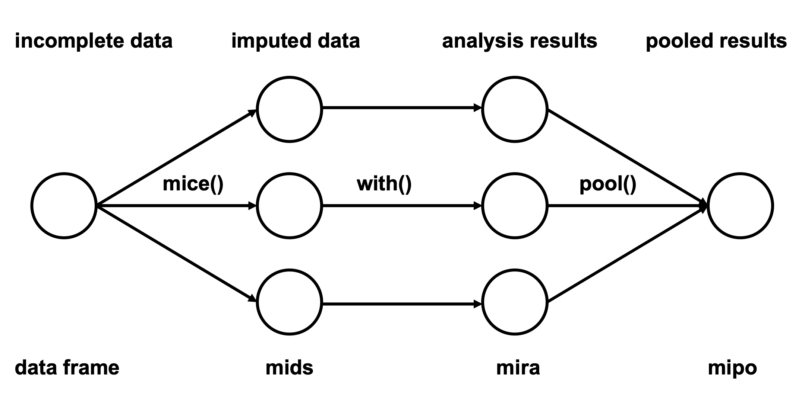
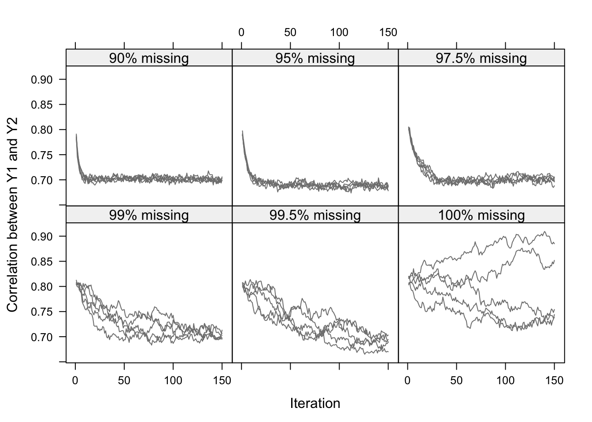

```{r setup}
library(mice)
library(ggmice)
library(ggplot2)
library(knitr)
library(xtable)
library(patchwork)

boys_xmpl <- boys[, 1:4]

mice <- function(..., print = FALSE) {
  mice::mice(..., print = print)
}

mice.mids <- function(..., print = FALSE) {
  mice::mice.mids(..., print = FALSE)
}
```

## Outlook

- We can now generate multiple imputations
- Now want want correct inferences, based on the multiply-imputed data

# Correct inferences with missing data {background-color="#FFCD00"}

## Missing data introduces additional uncertainty

- We don't know (with certainty) what the unknown value should be
- Pretending to know the unknown value underestimates uncertainty
- But we have multiple imputed values!

## Multiple imputations reflect the missing data uncertainty!

```{r}
set.seed(123)
x1 <- rnorm(100)
x2a <- x1 + rnorm(100, 0, 0.2)
x2a[1:20] <- NA
x2b <- x1 + rnorm(100, 0, 2)
x2b[1:20] <- NA

d1 <- mice(data.frame(x1 = x1, x2 = x2a))
d2 <- mice(data.frame(x1 = x1, x2 = x2b))

ggmice(d1, aes(x = x1, y = x2)) +
  geom_point() +
  ggmice(d2, aes(x = x1, y = x2)) +
  geom_point()
```

The more we know about the missing value, the more accurate our imputations!

## Analyses with missing data

:::{.nonincremental}
- Usually, the goal is not to impute the data as accurately as possible
- Instead, we want to do some interesting analysis
- E.g., a $t$-test, linear or logistic regression
:::

- We have multiple data sets now, how to proceed?
- Typical workflow: fit the model of interest to each imputed dataset: estimate parameter of interest and corresponding variance, and adjust for imputation uncertainty.

## A $t$-test with missing data

Q: Do individuals with hypertension have higher total serum cholesterol than individuals without hypertension.

```{r}
#| echo: true

imp <- mice(nhanes2)
fit <- with(imp, lm(chl ~ hyp))
summary(fit)
```


Maybe: The coefficient related to hypertension (`hypyes`) is larger than $0$ in all imputed datasets, but standard error is quite large as well.

How to formalize this?

## A $t$-test with missing data (visualized)

```{r}
grouped <- complete(imp, "long") |>
  dplyr::group_by(.imp, hyp) |>
  dplyr::summarize(chl = mean(chl))

ggmice(imp, aes(y = chl, x = hyp)) +
  geom_point(position = position_jitter(0.05)) +
  geom_point(data = grouped, aes(col = NULL), shape = 95, size = 11) # +
# geom_line(data = grouped, aes(col = NULL, group = .imp))
```

## Multiple imputation workflow




## What is estimated in multiple imputation?

After we have fitted the model of scientific interest (using the `with() function`) to each imputed data set, we have for each imputation $j = 1, \dots, m$:

- $\hat Q_j$: Estimate of parameters of interest
- $\bar U_j$: Estimate of the variance of $\hat Q_j$

## Pooling method

:::{.fragment}
Define $Q$, the quantity of interest (a population parameter).

- In each imputed data, estimate $Q$ by $\hat{Q}_j$
- Average over the imputed data sets: $\bar Q = \frac 1 m \sum_{j=1}^m \hat{Q}_j$.
:::

## The variance of $\bar Q$: three sources

:::{.nonincremental}
:::{.fragment .fade-in}
:::{.fragment .semi-fade-out}
- Sampling uncertainty (we do not observe the entire population)
    + The usual variance that we would also have without missing data: $\bar U = \frac 1 m \sum_{j=1}^m \hat U_j$
:::
:::
:::{.fragment .fade-in}
:::{.fragment .semi-fade-out}
- Missing data uncertainty (some information is unobserved)
    + We can impute, but we are seldom certain of the true underlying value
    + Between imputation uncertainty: $B = \frac{1}{m-1} \sum_{j=1}^m (\hat Q_j - \bar Q)'(\hat Q_j - \bar Q)$
:::
:::
:::{.fragment .fade-in}
:::{.fragment .semi-fade-out}
- Imputation uncertainty (we approximate the missing values with a finite number of draws from the posterior distribution)
    + More draws, the smaller our simulation error: $\frac B m$
:::
:::

:::{.fragment .fade-in}
- Total variance
    + Add all components together: $T = \bar U + B + \frac B m$
:::
:::

## Three sources of variation

In summary, the total variance $T$ stems from three sources:

1. $\bar U$, the variance caused by the fact that we are taking a
    sample rather than the entire population. This is the
    conventional statistical measure of variability;
2. $B$, the extra variance caused by the fact that there are
    missing values in the sample;
3. $B/m$, the extra simulation variance caused by the fact that $\bar Q_m$
    itself is based on finite $m$.


## Inferences from $\bar Q$

Now we have $\bar Q$ and its variance, we can make inferences

:::{.nonincremental}
- Significance testing (or Bayesian tests)
:::

Because the variance around $\bar Q$ is estimated from the data, inferences are based on a $t$-distribution, $H_0: Q = Q_0$ vs $H_1: Q \neq Q_0$.

:::{.fragment}
$p$-value: $P\Bigg(\frac{|\bar Q - Q_0|}{\sqrt{T}} > t_{(\nu, 1-\alpha/2)}\Bigg)$

:::{.nonincremental}
- $\nu$: degrees of freedom (given by software)
:::
:::

:::{.fragment}
$100(1-\alpha)\%$ confidence interval: $\bar Q \pm t_{(\nu, 1-\alpha/2)}\cdot \sqrt{T}$
:::

## How much information is contained in the missing data?

Proportion of variance attributable to the missing data
$$
\lambda = \frac{B + B/m}{T}
$$

Relative increase in variance due to non-response
$$
r = \frac{B + B/m}{T}
$$

Note: $r = \lambda/(1-\lambda), \lambda = r/(r+1)$

## Pooling inferences in `R`

### $t$-test
```{r}
#| echo: true
summary(pool(fit))
```

### Linear regression

```{r}
#| echo: true
fit <- with(imp, lm(chl ~ age + bmi))
summary(pool(fit))
```

### Logistic regression
```{r}
#| echo: true
fit <- with(imp, glm(hyp ~ bmi + chl, family = binomial))
summary(pool(fit), exponentiate = TRUE)
```

# Diagnosing problems {background-color="#FFCD00"}

Checking your imputation model

## Trace plot for convergence

```{r echo = TRUE}
imp <- mice(nhanes, print = FALSE, seed = 24415)
plot_trace(imp)
```

## Add imputations and re-evaluate

```{r}
imp <- mice.mids(imp, maxit = 15)
plot_trace(imp)
```

## Assessing non-convergence (I)

High correlation, (very) high proportion of missingness




## Assessing non-convergence (II)

```{r}
boys_xmpl <- boys[, 1:4]
```

```{r, echo = TRUE}
imp <- mice(boys_xmpl, maxit = 5, seed = 2425)
plot_trace(imp)
```

## Assessing non-convergence (II)

Let's try more imputations!

```{r, echo = TRUE}
imp <- mice.mids(imp, maxit = 20)
plot_trace(imp)
```

## Assessing non-convergence (II)

Still no success! What can be wrong?

:::{.fragment}
```{r}
ggmice(imp, aes(x = wgt / (hgt / 100)^2, y = bmi)) +
  geom_point()
```

BMI is a function of height and weight!
:::

# Advanced: Modelling deterministic or complex relationships {background-color="#FFCD00"}

## Passive imputation

Deterministic relationships can be modelled using __passive__ imputation.

Passive imputation: don't model distribution, but explicitly fix the model.

$$
\text{bmi} = \frac{\text{wgt} ~~ (\textit{kg})}{\text{hgt}^2 ~~ (\textit{m})}
$$

:::{.fragment}

### NOTE:

Passive variables cannot be used as predictor for variables it is constructed from

Passive variables should be imputed __after__ the variables it is constructed from

:::

## Passive imputation with `mice`

<br>

```{r}
#| echo: true
method <- mice::make.method(boys_xmpl)
method
```

<br>

```{r}
#| echo: true
method["bmi"] <- "~I(wgt/(hgt/100)^2)"
method
```

## Passive imputation: removing predictors

:::{.columns}
::::{.column width = "50%"}
```{r}
#| echo: true
predictors <- make.predictorMatrix(boys_xmpl)
predictors
predictors[c("hgt", "wgt"), "bmi"] <- 0
```

::::
::::{.column width = "50%"}
:::::{.fragment}

```{r}
#| echo: true
imp <- mice(
  boys_xmpl,
  method = method,
  predictorMatrix = predictors
)
```

:::::
::::
:::

:::{.fragment}
```{r}
ggmice(imp, aes(x = wgt / (hgt / 100)^2, y = bmi)) +
  geom_point()
```

:::

## When default `pmm` fails (I)

```{r}
set.seed(2234)

x <- runif(100, 1 / 2 * pi, 2.5 * pi)
y <- sin(x) + rnorm(100, 0, 0.3)

data <- data.frame(x = x, y = y)
data[c(1, 6), 2] <- NA
```

```{r}
#| width: 300px
#| height: 300px
#| top: 500px
#| left: 75px

ggmice(data, aes(x = x, y = y)) +
  geom_point()
```

## When default `pmm` fails (II)

:::{.columns}
::::{.column width="50%"}

```{r}
#| echo: true

method <- make.method(data)
method
```

::::
::::{.column width="50%"}
:::::{.fragment}

```{r}
#| echo: true
imp <- mice(data, m = 10)
```

:::::
::::
:::

:::{.fragment}

```{r}
#| bottom: 50px

ggmice(imp, aes(x = x, y = y)) +
  geom_point()
```

:::

## Changing imputation methods in `mice`

```{r}
#| echo: true

method["y"] <- "rf"
imp <- mice(data, method = method)
```

:::{.fragment}

```{r}
ggmice(imp, aes(x = x, y = y)) +
  geom_point()
```

:::


## Take aways

- Generating imputation is followed by analysis and pooling steps
- Multiple imputation yields correct hypothesis tests and confidence intervals from incomplete data
- Inspect imputed values for plausibility

<!-- TODO: add how to contact us after? -->